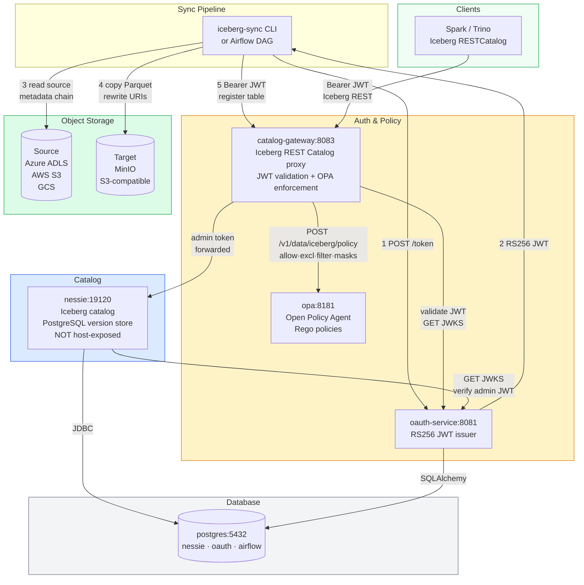
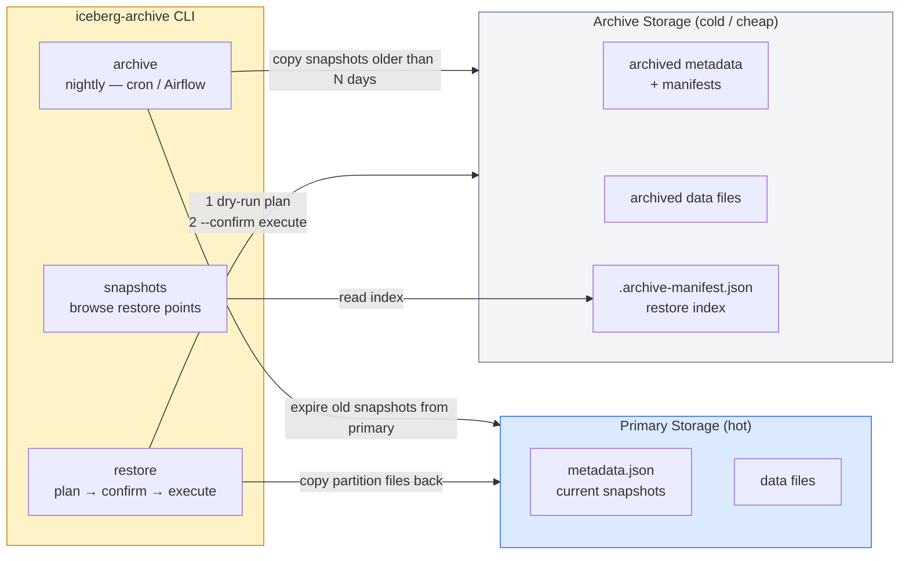
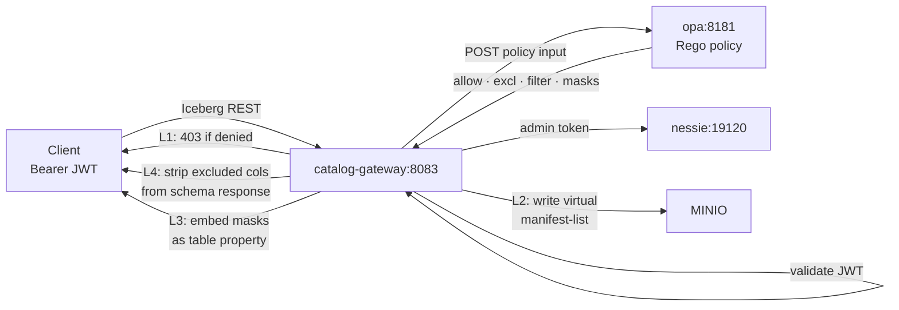

# iceberg-catalog-sync

Enterprise-grade platform-agnostic Apache Iceberg catalog replication with full metadata
chain rewrite, OAuth 2.0 authentication, and fine-grained data contract policy enforcement.

> **Core problem:** Iceberg metadata embeds absolute storage URIs at every level.
> Copying Parquet files from Azure to MinIO without rewriting metadata leaves every
> on-prem table pointing back at the cloud source — queries fail silently.
> This tool fixes that, then adds enterprise auth and authorization on top.

---

## System Architecture



---

## Archive & Partition Restore

Cold storage archival with on-demand partition-level restore.
See [docs/archive.md](docs/archive.md) for the full guide.



### Quick example

```bash
# 1. Archive snapshots older than 30 days
iceberg-archive archive \
  --source-root "s3://warehouse/iceberg/" \
  --archive-root "s3://cold-archive/iceberg/" \
  --table "gold/orders" --older-than 30d --no-dry-run

# 2. Browse what is available to restore
iceberg-archive snapshots \
  --archive-root "s3://cold-archive/iceberg/" --table "gold/orders"

# 3. Plan (dry-run, always first)
iceberg-archive restore \
  --archive-root "s3://cold-archive/iceberg/" \
  --target-root "s3://warehouse/iceberg/" \
  --table "gold/orders" \
  --partition "year=2025/month=11" --as-of "2025-12-01"

# 4. Execute after reviewing the plan
iceberg-archive restore ... --confirm
```

---

## What it does

### Sync steps (①–⑤)

```
① Discover   find latest metadata.json (version-hint.txt or directory scan)
② Diff       manifest-based file comparison (no naive directory diff)
③ Copy       parallel Parquet/Avro transfer; abort on any failure
④ Rewrite    PathTranslator rewrites every URI in metadata.json + manifests
⑤ Register   NessieCatalog commits the new pointer (optimistic concurrency)
```

### Archive & Restore (⑥–⑨)

```
⑥ Archive    Periodically copy old snapshots to cold storage; expire from primary
⑦ Index      .archive-manifest.json written to cold storage — lists every restore point
⑧ Plan       Dry-run: scan partitions, detect conflicts, print plan before any writes
⑨ Restore    Copy matching partition files back; reconstruct metadata; commit pointer
```

> See [docs/archive.md](docs/archive.md) for the full guide.

### Security layers (⑩–⑬)

```
⑥ Authenticate   OAuth 2.0 client credentials; RS256 JWT; OIDC discovery
⑦ Authorize      OPA allow/deny via Rego policy → HTTP 403 from gateway                (hard — Layer 1)
⑧ RLS            Virtual manifest-list: gateway writes filtered copy to MinIO,          (hard — Layer 2)
                   rewrites snapshot URL in GET table response → Spark downloads
                   only allowed partition files (transparent, no Spark cooperation)
⑨ CLS            Column exclusion: schema rewrite removes fields from metadata           (hard — Layer 4)
                 Column masking:   stored as table property; query engine applies       (advisory — Layer 3)
```

---

## What the stack provisions automatically

When you run `docker compose up -d` the following are created for you — no manual setup needed:

| Resource | How | Notes |
|----------|-----|-------|
| PostgreSQL databases | `init-dbs.sh` on first start | `nessie`, `oauth`, `airflow` — each with its own user |
| OAuth RSA key pair | Generated at oauth-service startup | Stored in the `oauth` database; survives restarts |
| OAuth clients | Seeded at oauth-service startup | The four default clients in the table below |
| MinIO `warehouse` bucket | `mc-init` one-shot container | Runs once; `mc mb --ignore-existing` is idempotent |
| Nessie `main` branch | Nessie first boot | Empty catalog — no namespaces or tables yet |

> **Iceberg tables are not pre-seeded.** The `warehouse` bucket starts empty (or retains whatever
> the persistent `minio-data` volume already holds from previous runs).
> Step 4 below syncs a table from a source you provide — see [docs/catalog-sync.md](docs/catalog-sync.md)
> for how to point the CLI at an existing Iceberg dataset.
>
> If you have already run the stack before you may see tables and Iceberg version files
> inside MinIO from previous syncs — this is the persistent volume, not pre-loaded test data.

---

## Quick Start

### 1. Start the stack

```bash
cd docker
docker compose up -d
docker compose logs -f oauth-service nessie
# Wait for: "Application startup complete." and "Nessie server started"
```

### 2. Verify services

```bash
# OAuth health
curl -s http://localhost:8081/health | jq .

# Catalog Gateway health
curl -s http://localhost:8083/health | jq .

# OPA health
curl -s http://localhost:8181/health | jq .

# Nessie (via gateway — Nessie port is not exposed to host)
TOKEN=$(curl -s -X POST http://localhost:8081/token \
  -d "grant_type=client_credentials&client_id=admin-client&client_secret=admin-secret" \
  | jq -r .access_token)
curl -s -H "Authorization: Bearer $TOKEN" http://localhost:8083/v1/config | jq .
```

### 3. Install the CLI

```bash
cd ..  # project root
python -m venv .venv && source .venv/bin/activate
pip install -e ".[nessie,dev,auth]"
iceberg-sync --help
```

### 4. Sync a table

```bash
iceberg-sync table \
  --source-root "s3a://warehouse/source/" \
  --target-root "s3a://warehouse/target/" \
  --table "gold/orders" \
  --source-endpoint http://localhost:9000 \
  --source-access-key minioadmin --source-secret-key minioadmin \
  --target-endpoint http://localhost:9000 \
  --target-access-key minioadmin --target-secret-key minioadmin \
  --nessie-uri http://localhost:8083 \
  --oauth-url http://localhost:8081 \
  --oauth-client-id sync-service \
  --oauth-client-secret sync-secret
```

The sync CLI registers the table via the catalog-gateway (port 8083). The gateway enforces
OPA policy before forwarding to Nessie.

---

## Default clients

| Client ID | Secret | Access |
|-----------|--------|--------|
| `admin-client` | `admin-secret` | All namespaces, all ops, no RLS/CLS |
| `sync-service` | `sync-secret` | All namespaces, read + write, no RLS/CLS |
| `analytics-client` | `analytics-secret` | `gold` read only, EMEA rows, PII masked |
| `data-scientist` | `ds-secret` | `silver`+`bronze` read, no RLS, PII excluded |

> Change all secrets before any non-local deployment.

---

## Access control overview



Policy is evaluated by OPA on every request:

```bash
# Query OPA directly
curl -s -X POST http://localhost:8181/v1/data/iceberg/policy \
  -H "Content-Type: application/json" \
  -d '{"input":{"principal":"analytics-client","namespace":"gold","table":"orders","operation":"READ"}}' \
  | jq .result
# → { "allow": true, "excluded_columns": ["ssn","credit_card_number"],
#     "row_filter": "region = 'EMEA'", "column_masks": {...} }
```

---

## Documentation

| Topic | Guide |
|-------|-------|
| Sync engine — CLI, Python API, platform support, consistency | [docs/catalog-sync.md](docs/catalog-sync.md) |
| **Archive & partition restore — config, workflow, examples** | **[docs/archive.md](docs/archive.md)** |
| Archive module — design, class diagrams, data flows | [docs/archive-dev.md](docs/archive-dev.md) |
| Nessie — PostgreSQL config, JWT auth, API usage | [docs/nessie-setup.md](docs/nessie-setup.md) |
| OAuth service — token flow, client management, OIDC | [docs/oauth-setup.md](docs/oauth-setup.md) |
| OPA policies — Rego structure, enforcement layers, adding principals | [docs/opa-policies.md](docs/opa-policies.md) |
| Airflow — DAG setup, operators, XCom contract | [docs/airflow.md](docs/airflow.md) |
| Production — IdP migration, secrets, HA | [docs/production.md](docs/production.md) |
| Developer guide — setup, tests, end-to-end walkthroughs | [DEVELOPMENT.md](DEVELOPMENT.md) |

---

## Project Structure

```
catalog-sync/
├── src/iceberg_sync/
│   ├── auth/
│   │   └── oauth_client.py        # Token manager (client credentials + auto-refresh)
│   ├── catalog/
│   │   └── nessie.py              # Nessie v2 client (OAuth wired in)
│   ├── metadata/
│   │   ├── reader.py              # Manifest chain walker (fastavro)
│   │   └── rewriter.py            # URI rewrite + version-hint commit
│   ├── storage/
│   │   ├── s3.py                  # AWS S3 / MinIO
│   │   ├── adls.py                # Azure ADLS Gen2
│   │   ├── gcs.py                 # Google Cloud Storage
│   │   └── memory.py              # In-memory (tests)
│   ├── archive/
│   │   ├── archiver.py            # IcebergArchiver — copy snapshots to cold storage
│   │   ├── restorer.py            # IcebergRestorer — plan + execute partition restore
│   │   ├── config.py              # YAML config (ArchiveJobConfig, RestoreJobConfig)
│   │   ├── archive_index.py       # .archive-manifest.json read/write
│   │   ├── partition_scanner.py   # Avro manifest walker + partition filter
│   │   ├── restore_planner.py     # RestorePlan dry-run builder
│   │   ├── snapshot_manager.py    # Retention policy decisions
│   │   └── metadata_editor.py     # metadata.json reconstruction for restore/expiry
│   ├── sync/
│   │   └── catalog_sync.py        # CatalogSync orchestrator
│   ├── airflow/
│   │   └── operators.py           # Airflow operator wrappers
│   ├── archive_cli.py             # iceberg-archive CLI entry point
│   └── cli.py                     # iceberg-sync CLI entry point
│
├── oauth_service/                 # OAuth 2.0 server (FastAPI)
│   ├── main.py                    # Token, JWKS, OIDC discovery, client CRUD
│   ├── crypto.py                  # RSA key gen + JWT signing
│   ├── models.py                  # SQLAlchemy: OAuthClient, KeyStore
│   └── config.py                  # pydantic-settings
│
├── catalog_gateway/               # Iceberg REST Catalog proxy + OPA enforcement (FastAPI)
│   ├── main.py                    # Catch-all proxy: JWT validate, OPA check, enforce, forward
│   │                              #   _filter_manifest_list_sync() — virtual manifest-list RLS
│   │                              #   _pyiceberg_plan_scan()       — server-side scan planning
│   ├── policy.py                  # JWT validation (PyJWKClient) + OPA async client
│   ├── requirements.txt           # includes fastavro for manifest Avro read/write
│   └── Dockerfile
│
├── opa/
│   └── policies/
│       └── iceberg.rego           # Rego access rules (hot-reloaded)
│
├── docker/
│   ├── docker-compose.yml         # 7-service stack (includes gateway + OPA)
│   └── postgres/
│       └── init-dbs.sh            # Creates nessie, oauth, airflow databases
│
└── docs/
    ├── catalog-sync.md
    ├── nessie-setup.md
    ├── oauth-setup.md
    ├── opa-policies.md            # OPA policy guide (replaces data-contracts.md)
    ├── airflow.md
    └── production.md
```
