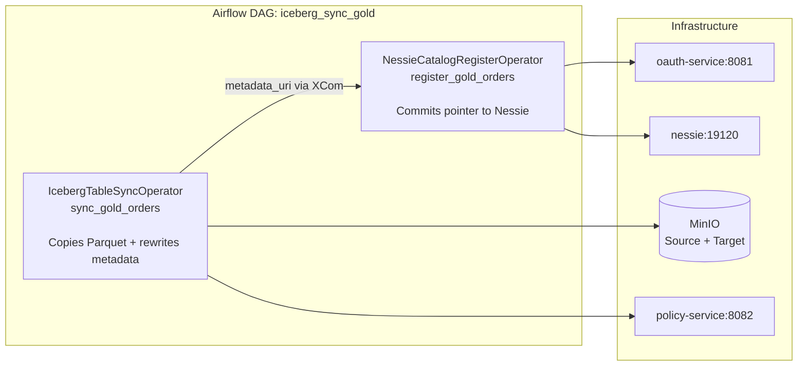
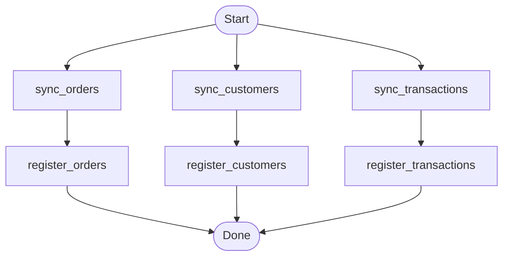

# Airflow Integration

Orchestrate Iceberg catalog sync pipelines using Apache Airflow with built-in
OAuth token management and Nessie registration.

---

## DAG Flow



---

## Setup

### Start with Airflow

```bash
# Start the full stack including Airflow
docker compose -f docker/docker-compose.yml \
               -f docker/docker-compose.airflow.yml up -d

# First-time initialisation (creates admin user + DB schema)
docker compose run --rm airflow-init

# Access the Airflow UI
open http://localhost:8080
# Login: admin / admin
```

### Airflow Variables

Set these in the Airflow UI (Admin → Variables) or via the CLI:

| Variable | Example value | Description |
|----------|--------------|-------------|
| `NESSIE_URI` | `http://nessie:19120` | Nessie base URL (internal Docker hostname) |
| `OAUTH_URL` | `http://oauth-service:8081` | OAuth service URL |
| `OAUTH_CLIENT_ID` | `sync-service` | OAuth client ID |
| `OAUTH_CLIENT_SECRET` | `sync-secret` | OAuth client secret (use Airflow secrets backend in production) |
| `POLICY_URL` | `http://policy-service:8082` | Policy service URL |
| `MINIO_ENDPOINT` | `http://minio:9000` | MinIO S3 endpoint |

---

## Operator examples

### Single table sync

```python
from airflow import DAG
from airflow.utils.dates import days_ago
from iceberg_sync.airflow.operators import (
    IcebergTableSyncOperator,
    NessieCatalogRegisterOperator,
)

with DAG(
    dag_id="iceberg_sync_gold_orders",
    schedule_interval="@daily",
    start_date=days_ago(1),
    catchup=False,
) as dag:

    sync = IcebergTableSyncOperator(
        task_id="sync_gold_orders",
        source_root="s3a://warehouse/source/",
        target_root="s3a://warehouse/target/",
        table="gold/orders",
        source_storage_kwargs=dict(
            endpoint_url="http://minio:9000",
            aws_access_key_id="minioadmin",
            aws_secret_access_key="minioadmin",
        ),
        target_storage_kwargs=dict(
            endpoint_url="http://minio:9000",
            aws_access_key_id="minioadmin",
            aws_secret_access_key="minioadmin",
        ),
    )

    register = NessieCatalogRegisterOperator(
        task_id="register_gold_orders",
        nessie_uri="{{ var.value.NESSIE_URI }}",
        namespace="gold",
        table="orders",
        # metadata_uri is passed via XCom from the sync task
        metadata_location="{{ task_instance.xcom_pull('sync_gold_orders')['target_metadata_uri'] }}",
        oauth_url="{{ var.value.OAUTH_URL }}",
        oauth_client_id="{{ var.value.OAUTH_CLIENT_ID }}",
        oauth_client_secret="{{ var.value.OAUTH_CLIENT_SECRET }}",
        policy_url="{{ var.value.POLICY_URL }}",
    )

    sync >> register
```

### Namespace fan-out (multiple tables in parallel)



```python
from airflow import DAG
from airflow.utils.dates import days_ago
from iceberg_sync.airflow.operators import (
    IcebergTableSyncOperator,
    NessieCatalogRegisterOperator,
)

TABLES = ["orders", "customers", "transactions"]
STORAGE = dict(
    endpoint_url="http://minio:9000",
    aws_access_key_id="minioadmin",
    aws_secret_access_key="minioadmin",
)

with DAG(
    dag_id="iceberg_sync_gold_namespace",
    schedule_interval="@daily",
    start_date=days_ago(1),
    catchup=False,
) as dag:

    for table in TABLES:
        sync = IcebergTableSyncOperator(
            task_id=f"sync_gold_{table}",
            source_root="s3a://warehouse/source/",
            target_root="s3a://warehouse/target/",
            table=f"gold/{table}",
            source_storage_kwargs=STORAGE,
            target_storage_kwargs=STORAGE,
        )

        register = NessieCatalogRegisterOperator(
            task_id=f"register_gold_{table}",
            nessie_uri="{{ var.value.NESSIE_URI }}",
            namespace="gold",
            table=table,
            metadata_location=f"{{{{ task_instance.xcom_pull('sync_gold_{table}')['target_metadata_uri'] }}}}",
            oauth_url="{{ var.value.OAUTH_URL }}",
            oauth_client_id="{{ var.value.OAUTH_CLIENT_ID }}",
            oauth_client_secret="{{ var.value.OAUTH_CLIENT_SECRET }}",
            policy_url="{{ var.value.POLICY_URL }}",
        )

        sync >> register
```

---

## XCom contract

`IcebergTableSyncOperator` pushes the following dict to XCom on success:

```python
{
    "target_metadata_uri": "s3a://warehouse/target/gold/orders/metadata/v2.metadata.json",
    "files_copied": 42,
    "bytes_copied": 1234567890,
    "snapshot_id": 1234567890,
}
```

`NessieCatalogRegisterOperator` reads `target_metadata_uri` from XCom to commit the pointer.

---

## Token lifecycle in DAGs

OAuth tokens are managed automatically — Airflow operators do not need to handle token
refresh. The `OAuthClient` inside each operator:

1. Fetches a token on first use
2. Caches the token in memory for the lifetime of the operator instance
3. Automatically refreshes 30 seconds before expiry

For long-running DAGs or retried tasks, each `NessieCatalogRegisterOperator` instantiation
creates a fresh `OAuthClient`, so stale tokens are never an issue.
