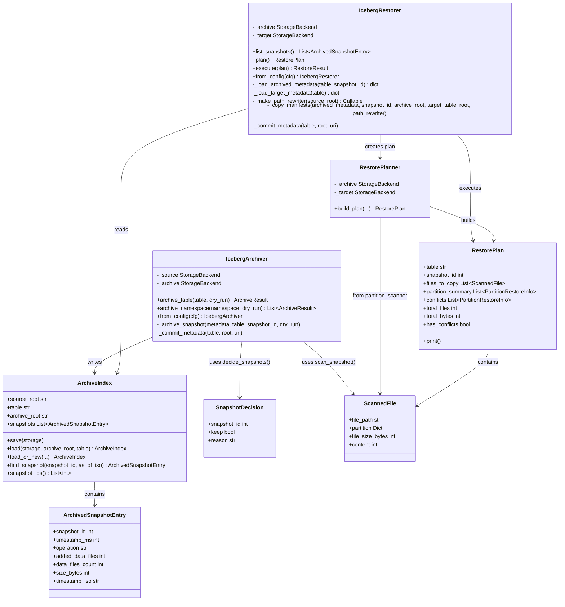
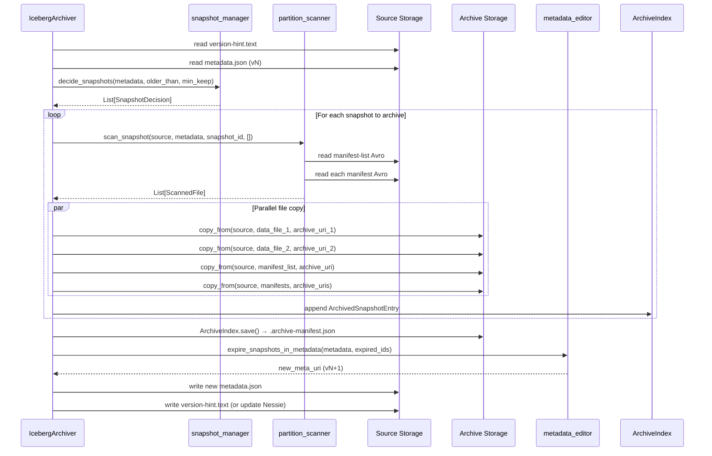
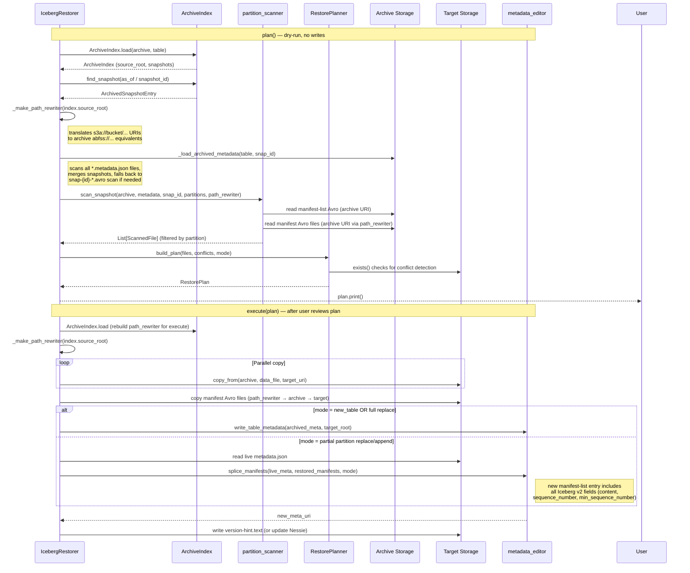
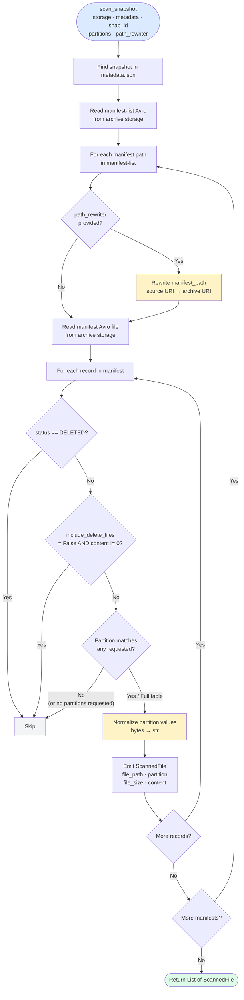
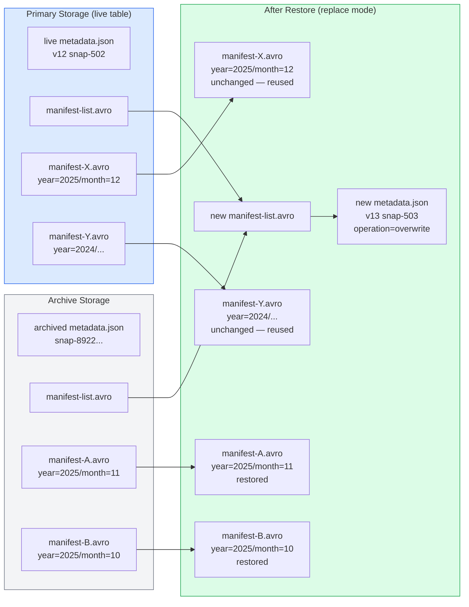
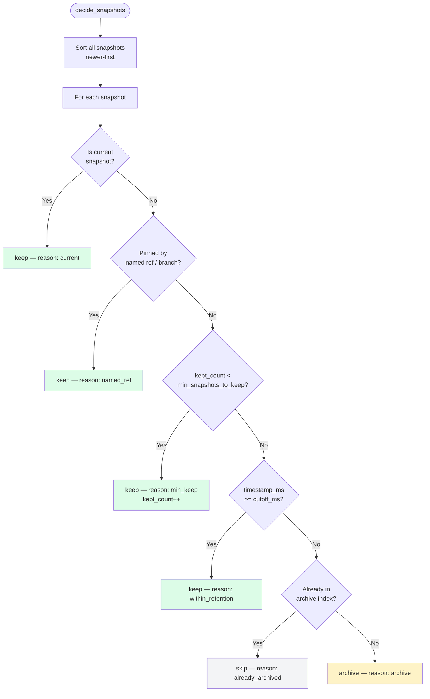
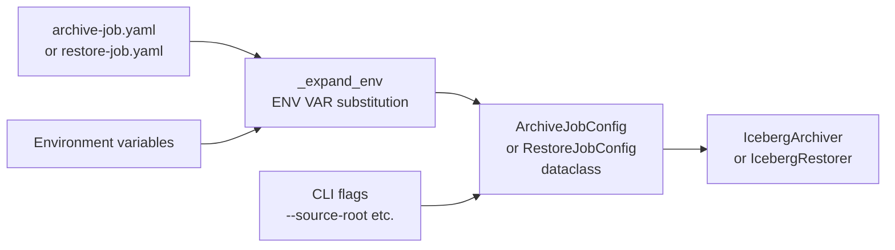
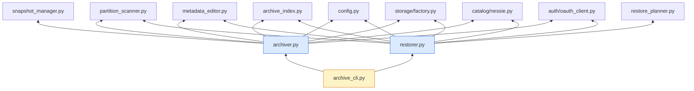

# Archive Module — Developer Guide

Design rationale, class diagrams, data flows, and extension points for the
`iceberg_sync.archive` module.

---

## Design Goals

| Goal | Decision |
|------|----------|
| **Reuse existing infrastructure** | `StorageBackend`, `create_storage()`, `NessieCatalog`, `OAuthClient` — zero new cloud SDK calls. |
| **Manifest-based accuracy** | File lists are derived from Avro manifests, not directory listings.  Handles custom `write.data.path` and Iceberg v2 delete files. |
| **Plan before execute** | `RestorePlan` is built once (dry-run), printed for human review, then passed verbatim to `execute()`. What you see is what runs. |
| **Fail-safe writes** | Data files are copied before metadata is rewritten.  A copy failure aborts before touching metadata — the primary table stays valid. |
| **No JVM / PyIceberg dependency** | `fastavro` for Avro I/O, `orjson` for JSON, consistent with the rest of the project. |
| **Config-first** | YAML config with `${ENV_VAR}` substitution for scheduling.  CLI flags override config for ad-hoc use. |

---

## Module Structure

```
src/iceberg_sync/
├── archive/
│   ├── __init__.py            Exports IcebergArchiver, IcebergRestorer
│   ├── config.py              Dataclasses + YAML loader (ArchiveJobConfig, RestoreJobConfig)
│   ├── archive_index.py       ArchiveIndex — .archive-manifest.json read/write
│   ├── snapshot_manager.py    Retention policy: which snapshots to archive/keep
│   ├── partition_scanner.py   Avro manifest walker + partition filter
│   ├── restore_planner.py     RestorePlan builder — dry-run, conflict detection
│   ├── archiver.py            IcebergArchiver orchestrator
│   ├── restorer.py            IcebergRestorer orchestrator (plan → execute)
│   └── metadata_editor.py     metadata.json reconstruction for restore + expiry
└── archive_cli.py             Click CLI: iceberg-archive entry point
```

---

## Class Diagram



---

## Archive Data Flow



---

## Restore Data Flow



---

## Partition Scanning Logic



### Partial key matching

A requested partition `{"year": 2025}` matches any file whose partition record
contains `year=2025`, regardless of other fields (e.g. `month`, `day`).

```python
def _normalize_partition_value(v):
    """Decode bytes partition values to str (Iceberg stores strings as binary in Avro)."""
    if isinstance(v, (bytes, bytearray)):
        return v.decode("utf-8")
    return v

def _partition_matches(file_partition, requested):
    for key, value in requested.items():
        actual = _normalize_partition_value(file_partition.get(key))
        if actual != value:
            return False
    return True
```

> **Note:** Iceberg encodes string partition values as raw bytes in Avro.
> `_normalize_partition_value` decodes them to `str` before comparison so callers
> can always pass plain Python strings (e.g. `{"order_month": "2024-03"}`).

This means you can restore an entire year's worth of data across all months
by specifying `--partition year=2025` rather than listing every month.

---

## Metadata Reconstruction



Key points:
- Existing manifests for **unaffected partitions** are reused verbatim — no rewrite.
- Restored manifests are added to the new manifest-list alongside current ones.
- A new snapshot (`snap-503`) with `operation=overwrite` is appended.
- The old snapshot (`snap-502`) remains in history for time-travel.
- Internal Avro manifest paths are rewritten from source storage URIs to archive URIs
  via `_make_path_rewriter` before reading — the archive files themselves are not modified.
- The new manifest-list entry includes all Iceberg v2 required fields: `content`,
  `sequence_number`, `min_sequence_number`, and row-count statistics.

---

## Snapshot Retention Decision



---

## Config Loading



Environment variable substitution uses `${VAR}` syntax.  If the variable is
not set, the literal `${VAR}` string is preserved (visible in logs — useful
for debugging misconfigured secrets).

---

## Key Interfaces

### StorageBackend (reused from core)

All archive/restore I/O goes through `StorageBackend`.  No new cloud SDK calls
are made in this module — `create_storage(uri, **kwargs)` from
`iceberg_sync.storage.factory` selects the correct backend.

| Method | Used by |
|--------|---------|
| `read_bytes(uri)` | partition_scanner, metadata_editor, restorer |
| `write_bytes(uri, data)` | metadata_editor, archive_index |
| `copy_from(src_backend, src_uri, dst_uri)` | archiver, restorer |
| `exists(uri)` | restore_planner (conflict detection) |
| `list_objects(prefix)` | restorer (finding latest archived metadata) |

### NessieCatalog (reused from core)

After writing a new metadata file, `archiver._commit_metadata()` and
`restorer._commit_metadata()` both try `nessie.update(table, new_meta_uri)`
first, falling back to writing `version-hint.text` if Nessie is not configured.

---

## Adding a New Storage Backend

No changes needed in the archive module — add the backend to
`iceberg_sync.storage` following the `StorageBackend` ABC, register it in
`create_storage()`, and it will automatically be available for archive/restore.

---

## Testing Approach

Use `MemoryStorageBackend` (already in the project) to write unit tests
without cloud credentials:

```python
from iceberg_sync.storage.memory import MemoryStorageBackend
from iceberg_sync.archive.archiver import IcebergArchiver

source = MemoryStorageBackend()
archive = MemoryStorageBackend()

# Seed source with a minimal metadata.json + manifest Avro files
# ...

archiver = IcebergArchiver(
    source_storage=source,
    archive_storage=archive,
    source_root="mem://source/iceberg/",
    archive_root="mem://archive/iceberg/",
    older_than="1ms",   # expire everything immediately in tests
    min_snapshots_to_keep=1,
    delete_after_archive=True,
)

result = archiver.archive_table("gold/orders", dry_run=False)
assert result.success
assert result.snapshots_archived == 1
```

---

## Error Handling Contract

| Failure point | Behaviour |
|---------------|-----------|
| Cannot load source metadata | `ArchiveResult.errors` populated; no writes to archive |
| File copy failure (archive) | Log warning; snapshot skipped; other snapshots continue |
| File copy failure (restore) | **Abort immediately**; no metadata written; primary unchanged |
| Nessie update failure | Warning logged; fall back to `version-hint.text` |
| Conflict with `strategy=fail` | `RuntimeError` raised before any copy begins |
| Archive index missing | `ArchiveIndex.load_or_new()` starts a fresh index; not an error |
| Archived metadata missing | `FileNotFoundError` — restore cannot proceed; user must verify archive |

---

## Dependency Map


