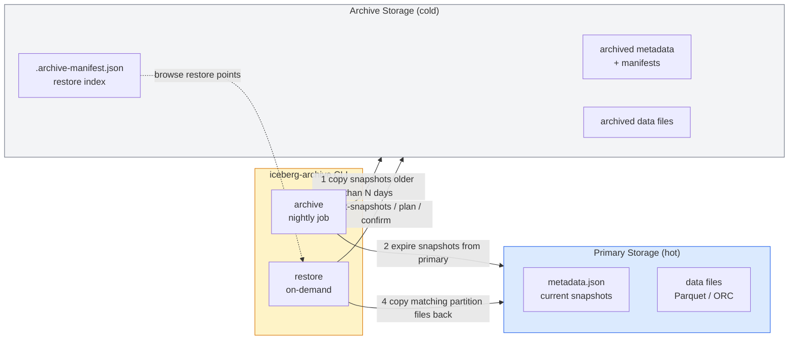
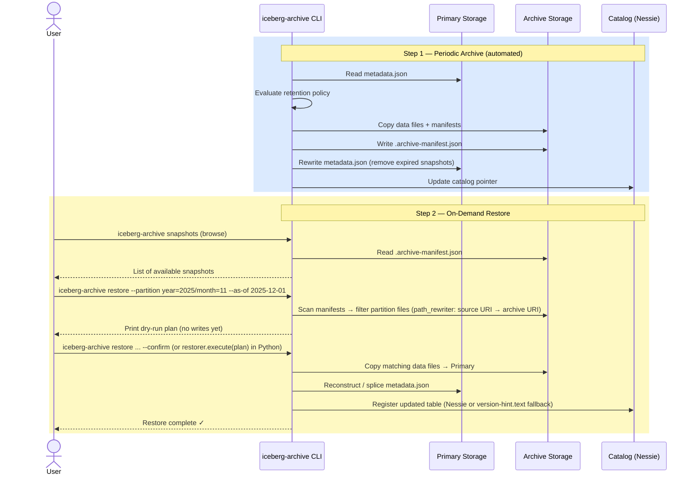
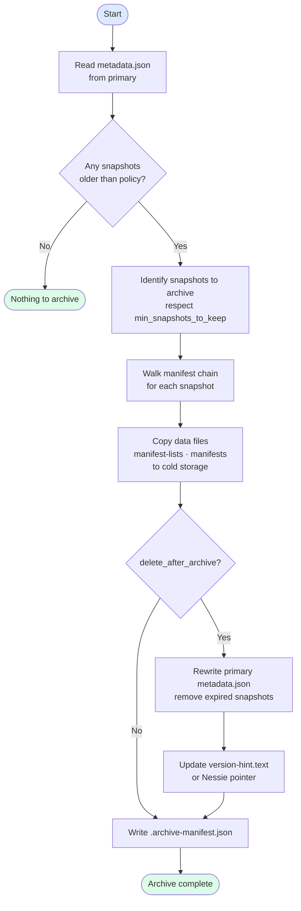
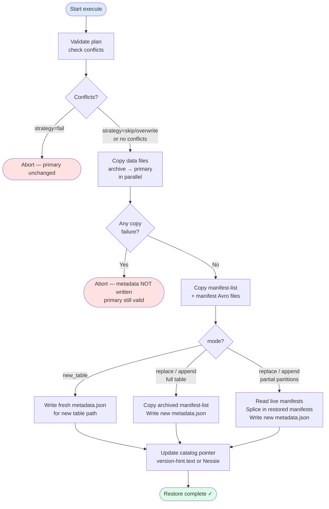

# Iceberg Archive & Partition Restore

Periodic archival of Iceberg snapshots to cold storage, with on-demand
partition-level restore back into the live table.

---

## Overview



---

## Concepts

| Term | Meaning |
|------|---------|
| **Archive** | Copy old snapshots (and their data files) to cheaper cold storage, then expire them from the primary table. |
| **Retention policy** | Rules that decide which snapshots are old enough to archive: `older_than` duration + `min_snapshots_to_keep`. |
| **Archive index** | A small `.archive-manifest.json` file written in cold storage. Records every archived snapshot so restore can browse them without reading the full Avro chain. |
| **Restore plan** | A dry-run report produced before any writes — shows exactly which files will be copied and how metadata will change. |
| **Partition restore** | Copy back only the data files belonging to specific partition values (e.g. `year=2025/month=11`) into the live table. |
| **Full table restore** | Copy all files from an archived snapshot and make it the new live table state. |

---

## Installation

```bash
pip install -e ".[archive]"
iceberg-archive --help
```

---

## Workflow



---

## Step 1 — Archive

### Config file (recommended for scheduled jobs)

```yaml
# archive-job.yaml

source:
  root: "s3://warehouse/iceberg/"
  table: "gold/orders"           # or use namespace: "gold" for all tables
  s3:
    region: "eu-west-2"
    access_key: "${AWS_ACCESS_KEY_ID}"
    secret_key: "${AWS_SECRET_ACCESS_KEY}"

archive:
  root: "s3://cold-archive/iceberg/"
  s3:
    region: "eu-west-2"
    access_key: "${ARCHIVE_ACCESS_KEY_ID}"
    secret_key: "${ARCHIVE_SECRET_ACCESS_KEY}"

policy:
  older_than: "30d"              # archive snapshots older than 30 days
  min_snapshots_to_keep: 2       # always keep at least 2 on primary
  delete_after_archive: true     # expire from primary after copying

catalog:
  nessie_uri: "http://nessie:19120"
  nessie_ref: "main"
  oauth_url: "http://oauth:8081"
  oauth_client_id: "${OAUTH_CLIENT_ID}"
  oauth_client_secret: "${OAUTH_CLIENT_SECRET}"

transfer:
  parallelism: 8

dry_run: true                    # set to false to actually run
```

### Run (dry-run first)

```bash
# Preview what would be archived
iceberg-archive archive --config archive-job.yaml

# Execute
iceberg-archive archive --config archive-job.yaml --no-dry-run
```

### Or inline (ad-hoc)

```bash
iceberg-archive archive \
  --source-root "s3://warehouse/iceberg/" \
  --table "gold/orders" \
  --archive-root "s3://cold-archive/iceberg/" \
  --older-than 30d \
  --min-snapshots-to-keep 2 \
  --source-region eu-west-2 \
  --source-access-key "$AWS_ACCESS_KEY_ID" \
  --source-secret-key "$AWS_SECRET_ACCESS_KEY" \
  --archive-region eu-west-2 \
  --archive-access-key "$ARCHIVE_KEY_ID" \
  --archive-secret-key "$ARCHIVE_SECRET" \
  --no-dry-run
```

### What happens internally



---

## Step 2 — Browse available snapshots

Before restoring, check what is available in the archive:

```bash
iceberg-archive snapshots \
  --archive-root "s3://cold-archive/iceberg/" \
  --table "gold/orders" \
  --archive-region eu-west-2 \
  --archive-access-key "$ARCHIVE_KEY_ID" \
  --archive-secret-key "$ARCHIVE_SECRET"
```

Example output:

```
              Archived snapshots — gold/orders
┌──────────────────────┬──────────────────────────┬───────────┬───────┬────────┐
│ Snapshot ID          │ Timestamp (UTC)           │ Operation │ Files │ Size   │
├──────────────────────┼──────────────────────────┼───────────┼───────┼────────┤
│ 8922341234567890     │ 2025-12-01 03:00:00 UTC   │ append    │ 80    │ 2.1 GB │
│ 7811231123456789     │ 2025-11-01 03:00:00 UTC   │ append    │ 75    │ 1.9 GB │
│ 6700120012345678     │ 2025-10-01 03:00:00 UTC   │ overwrite │ 92    │ 2.4 GB │
└──────────────────────┴──────────────────────────┴───────────┴───────┴────────┘
```

---

## Step 3 — Restore: Dry-run plan

**Always run a dry-run first.** This never writes anything.

### Config file (recommended)

```yaml
# restore-job.yaml

source:
  archive_root: "s3://cold-archive/iceberg/"
  table: "gold/orders"
  s3:
    region: "eu-west-2"
    access_key: "${ARCHIVE_ACCESS_KEY_ID}"
    secret_key: "${ARCHIVE_SECRET_ACCESS_KEY}"

target:
  root: "s3://warehouse/iceberg/"
  # restore_as: "gold/orders_restored"  # uncomment for side-by-side restore
  s3:
    region: "eu-west-2"
    access_key: "${AWS_ACCESS_KEY_ID}"
    secret_key: "${AWS_SECRET_ACCESS_KEY}"

restore:
  mode: replace                 # replace | append | new_table
  as_of: "2025-12-01"           # point-in-time  OR use snapshot_id:
  # snapshot_id: 8922341234567890

  partitions:
    - year: 2025
      month: 11
    - year: 2025
      month: 10
    # partial key match — restores ALL months under year=2025:
    # - year: 2025

  conflict_strategy: fail       # fail | skip | overwrite

catalog:
  nessie_uri: "http://nessie:19120"
  nessie_ref: "main"

dry_run: true                   # always start true — flip to false after review
```

### Generate the plan

```bash
# Plan only (safe default — no --confirm flag)
iceberg-archive restore --config restore-job.yaml
```

Example plan output:

```
╭─────────────────╮
│  Restore Plan   │
╰─────────────────╯

  Archive    s3://cold-archive/iceberg/
  Target     s3://warehouse/iceberg/
  Table      gold/orders
  Mode       replace
  Snapshot   8922341234567890  (2025-12-01 03:00:00 UTC)
  Scope      2 partition(s)

 Partition           Files  Size    Conflict
 ──────────────────────────────────────────
 year=2025/month=11    38   0.9 GB  none
 year=2025/month=10    42   1.2 GB  15 files → fail

  Total: 80 files   2.1 GB

 Metadata actions:
  • Merge 2 partition(s) into live snapshot of gold/orders  v12 → v13
  • Update catalog pointer  version-hint.text or Nessie register

  ⚠  Partition year=2025/month=10: 15 conflicting file(s).
     Use --conflict-strategy=overwrite to proceed.

This is a dry-run plan. Pass --confirm (or call restorer.execute(plan)) to apply.
```

---

## Step 4 — Restore: Execute

Once you have reviewed the plan and are satisfied, add `--confirm`:

```bash
# Inline
iceberg-archive restore \
  --archive-root "s3://cold-archive/iceberg/" \
  --target-root "s3://warehouse/iceberg/" \
  --table "gold/orders" \
  --as-of "2025-12-01" \
  --partition "year=2025/month=11" \
  --partition "year=2025/month=10" \
  --mode replace \
  --conflict-strategy overwrite \
  --archive-region eu-west-2 \
  --archive-access-key "$ARCHIVE_KEY_ID" \
  --archive-secret-key "$ARCHIVE_SECRET" \
  --target-region eu-west-2 \
  --target-access-key "$AWS_ACCESS_KEY_ID" \
  --target-secret-key "$AWS_SECRET_ACCESS_KEY" \
  --confirm

# Or via config file (set dry_run: false)
iceberg-archive restore --config restore-job.yaml --confirm
```

What the execute step does:



---

## Restore modes

| Mode | Use case | Effect on live table |
|------|----------|----------------------|
| `replace` | Restore overrides live data for restored partitions | New snapshot with `operation=overwrite` scoped to restored partitions |
| `append` | Archived data added alongside live data (time-travel accessible) | New snapshot with `operation=append` — existing data untouched |
| `new_table` | Safest — restore to a completely new table | Live table unchanged; new table created at `restore_as` path |

### Side-by-side restore (safest option)

Restore to a new table name — the live table is never touched:

```bash
iceberg-archive restore \
  --archive-root "s3://cold-archive/iceberg/" \
  --target-root "s3://warehouse/iceberg/" \
  --table "gold/orders" \
  --restore-as "gold/orders_restored_20251201" \
  --as-of "2025-12-01" \
  --mode new_table \
  --confirm
```

---

## Partition syntax

Partitions are specified as `key=value` pairs separated by `/`.
Repeat `--partition` for multiple partitions.

```bash
# Single partition
--partition "year=2025/month=11"

# Multiple partitions
--partition "year=2025/month=11" \
--partition "year=2025/month=10"

# Partial key (restores ALL months under year=2025)
--partition "year=2025"

# Full table (omit --partition entirely)
```

In YAML config:
```yaml
restore:
  partitions:
    - year: 2025
      month: 11
    - year: 2025
      month: 10
    # partial key — all months:
    # - year: 2025
```

---

## Python API

```python
from iceberg_sync.archive import IcebergArchiver, IcebergRestorer
from iceberg_sync.archive.config import ArchiveJobConfig, RestoreJobConfig

# ── Archive ────────────────────────────────────────────────────────────────
archive_cfg = ArchiveJobConfig.from_yaml("archive-job.yaml")
archiver = IcebergArchiver.from_config(archive_cfg)

result = archiver.archive_table("gold/orders", dry_run=False)
print(f"Archived {result.snapshots_archived} snapshots, {result.files_copied} files")

# ── Restore ────────────────────────────────────────────────────────────────
restore_cfg = RestoreJobConfig.from_yaml("restore-job.yaml")
restorer = IcebergRestorer.from_config(restore_cfg)

# Step 1: browse
restorer.list_snapshots()

# Step 2: plan (always first)
plan = restorer.plan()

# Step 3: execute after review
result = restorer.execute(plan)
print(f"Restored {result.files_copied} files → {result.new_metadata_uri}")
```

---

## Airflow integration

```python
from iceberg_sync.airflow.operators import (
    IcebergArchiveOperator,
    IcebergRestoreOperator,
)

# Nightly archive DAG
archive_task = IcebergArchiveOperator(
    task_id="archive_gold_orders",
    config_file="s3://config/archive-job.yaml",
    dry_run=False,
)

# On-demand restore DAG (triggered manually)
restore_task = IcebergRestoreOperator(
    task_id="restore_partitions",
    config_file="s3://config/restore-job.yaml",
    # inline overrides:
    partitions=[{"year": 2025, "month": 11}],
    confirm=True,
)
```

---

## Config file reference

### archive-job.yaml

| Key | Required | Default | Description |
|-----|----------|---------|-------------|
| `source.root` | yes | — | Primary storage root URI |
| `source.table` | one of | — | Table path (or use `source.namespace`) |
| `source.namespace` | one of | — | Archive all tables in namespace |
| `source.s3.*` | — | — | S3/MinIO credentials |
| `source.adls.*` | — | — | Azure ADLS credentials |
| `archive.root` | yes | — | Cold storage root URI |
| `archive.s3.*` / `archive.adls.*` | — | — | Archive storage credentials |
| `policy.older_than` | — | `30d` | Snapshot age threshold |
| `policy.min_snapshots_to_keep` | — | `1` | Never go below this count |
| `policy.delete_after_archive` | — | `true` | Expire from primary after copy |
| `catalog.nessie_uri` | — | — | Nessie base URL |
| `catalog.nessie_ref` | — | `main` | Branch / tag |
| `transfer.parallelism` | — | `8` | Concurrent file copy threads |
| `dry_run` | — | `true` | Preview only if true |

### restore-job.yaml

| Key | Required | Default | Description |
|-----|----------|---------|-------------|
| `source.archive_root` | yes | — | Cold storage root URI |
| `source.table` | yes | — | Table path in archive |
| `target.root` | yes | — | Primary storage root URI |
| `target.restore_as` | — | same as table | Restore to different table name |
| `restore.as_of` | one of | latest | ISO date (YYYY-MM-DD) |
| `restore.snapshot_id` | one of | latest | Explicit snapshot ID |
| `restore.partitions` | — | all | List of partition dicts |
| `restore.mode` | — | `replace` | `replace` \| `append` \| `new_table` |
| `restore.conflict_strategy` | — | `fail` | `fail` \| `skip` \| `overwrite` |
| `dry_run` | — | `true` | Show plan only if true |

---

## Troubleshooting

**`No archived snapshot found`**
Run `iceberg-archive snapshots` to see what is in the archive index.  If the
index is empty, the table has not been archived yet — run `iceberg-archive archive` first.

**`Restore blocked: N partition conflict(s)`**
Files already exist at the target path for the partitions you are restoring.
Options:
- `--conflict-strategy overwrite` — overwrite existing files.
- `--conflict-strategy skip` — skip files that already exist.
- `--restore-as gold/orders_backup` + `--mode new_table` — restore side-by-side.

**`No files found for snapshot … matching partitions`**
The partition key/value you specified does not match the table's partition spec,
or the archive manifest paths could not be read from the archive backend.

- Run `iceberg-archive snapshots` and check the `partition_spec` field in
  `.archive-manifest.json` to confirm field names.
- Always pass partition values as plain strings (e.g. `"2024-03"`).
  The scanner normalises Avro binary values to strings automatically.
- If you archive to a different storage backend than the source (e.g. source = S3,
  archive = ADLS), ensure the `archive_root` in the restore config matches the URI
  prefix used during archiving so internal manifest paths are translated correctly.

**Archive index missing (`.archive-manifest.json` not found)**
The archive storage location may be wrong, or the table was archived with an
older version that did not write the index.  In that case, use `--snapshot-id`
pointing to a known snapshot ID, and the restorer will fall back to scanning
the archived `metadata.json` directly.
