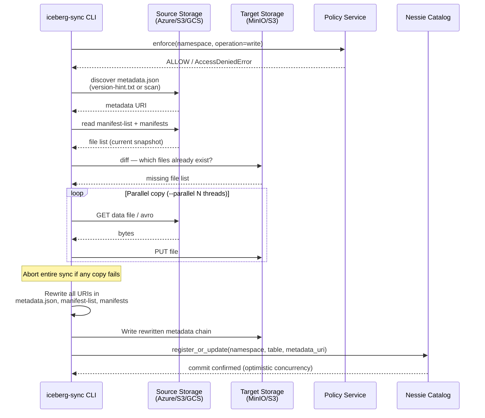

# Catalog Sync Engine

Apache Iceberg incremental sync with full metadata chain rewrite.

---

## The Problem

When Azure Fabric, AWS Glue, or Spark writes an Iceberg table, every file in the metadata
chain embeds the source cloud's absolute URI:

```
metadata.json     → location: abfss://iceberg@account.dfs.core.windows.net/gold/orders
  snap-1000.avro  → manifest_path: abfss://.../snap-1000-m-001.avro
    m-001.avro    → data_file.file_path: abfss://.../data/00001.parquet
```

Copying Parquet files to MinIO without rewriting these URIs leaves every pointer
still pointing at Azure. The on-prem cluster cannot reach Azure — the table is silently broken.

---

## Sync Flow



### Steps in detail

| Step | What happens |
|------|-------------|
| **① Discover** | Locate the latest `metadata.json` via `version-hint.text` (Hadoop) or directory scan |
| **② Diff** | Manifest-based file comparison — only files referenced in the current snapshot are considered |
| **③ Copy** | Parallel Parquet/Avro transfer; any single failure aborts the entire sync |
| **④ Rewrite** | `PathTranslator` rewrites every URI in `metadata.json`, manifest-lists, and manifests |
| **⑤ Register** | `NessieCatalog.register_or_update()` commits the new pointer under the branch hash |

**Zero JVM dependency.** Avro is handled by `fastavro`. No PyIceberg version coupling.

---

## CLI Reference

### Install

```bash
python -m venv .venv
source .venv/bin/activate     # Windows: .venv\Scripts\activate
pip install -e ".[nessie,dev,auth]"
iceberg-sync --help
```

### `iceberg-sync table` — single table

```bash
iceberg-sync table \
  --source-root "abfss://iceberg@account.dfs.core.windows.net/iceberg/" \
  --target-root "s3a://warehouse/azure/" \
  --table "gold/top_customers" \
  --source-secret-key "$AZURE_STORAGE_KEY" \
  --target-endpoint http://localhost:9000 \
  --target-access-key minioadmin --target-secret-key minioadmin \
  --nessie-uri http://localhost:19120 \
  --oauth-url http://localhost:8081 \
  --oauth-client-id sync-service \
  --oauth-client-secret sync-secret \
  --policy-url http://localhost:8082
```

### `iceberg-sync namespace` — all tables in a namespace

```bash
iceberg-sync namespace \
  --source-root "s3://prod-warehouse/iceberg/" \
  --target-root "s3a://warehouse/aws/" \
  --namespace "gold" \
  --source-region eu-west-2 \
  --target-endpoint http://localhost:9000 \
  --target-access-key minioadmin --target-secret-key minioadmin \
  --nessie-uri http://localhost:19120 \
  --oauth-url http://localhost:8081 \
  --oauth-client-id sync-service \
  --oauth-client-secret sync-secret \
  --policy-url http://localhost:8082
```

### Storage options

| Option | Description |
|--------|-------------|
| `--source-root` | Source warehouse root URI |
| `--target-root` | Target warehouse root URI |
| `--source-region` | AWS region for S3 sources (default: `eu-west-2`) |
| `--source-endpoint` | S3-compatible endpoint (MinIO, Ceph, etc.) |
| `--source-access-key` | S3 / MinIO access key |
| `--source-secret-key` | S3 access secret **or** Azure storage account key |
| `--target-endpoint` | Target S3-compatible endpoint |
| `--target-access-key` | Target S3 access key |
| `--target-secret-key` | Target S3 secret key |
| `--target-account-name` | Azure storage account name (target) |
| `--target-account-key` | Azure storage account key (target) |
| `--parallel` | Parallel copy threads (default: 4) |
| `--all-snapshots` | Rewrite all historical snapshots for time-travel support |
| `--dry-run` | Show plan without making any changes |

### Nessie options

| Option | Description |
|--------|-------------|
| `--nessie-uri` | Nessie base URL. When provided, registers the table after sync. |
| `--nessie-ref` | Nessie branch name (default: `main`) |
| `--nessie-token` | Static Bearer token (use `--oauth-*` for auto-refresh instead) |
| `--metadata-location` | Explicit metadata.json URI — bypasses filesystem discovery |

### OAuth options

| Option | Env var | Description |
|--------|---------|-------------|
| `--oauth-url` | `OAUTH_URL` | OAuth service base URL |
| `--oauth-client-id` | `OAUTH_CLIENT_ID` | OAuth client ID |
| `--oauth-client-secret` | `OAUTH_CLIENT_SECRET` | OAuth client secret |
| `--oauth-scope` | — | Scopes to request (default: `catalog:read catalog:write`) |
| `--policy-url` | `POLICY_URL` | Policy service URL for data contract enforcement |

---

## Python API

```python
from iceberg_sync.auth import OAuthClient, PolicyClient, AccessDeniedError
from iceberg_sync.catalog.nessie import NessieCatalog
from iceberg_sync.sync import CatalogSync
from iceberg_sync.path_translator import PathTranslator
from iceberg_sync.storage import create_storage

# 1. Auth: token manager (auto-refreshes before expiry)
oauth = OAuthClient(
    server_url="http://localhost:8081",
    client_id="sync-service",
    client_secret="sync-secret",
    scope="catalog:read catalog:write",
)

# 2. Policy enforcement
policy = PolicyClient(
    service_url="http://localhost:8082",
    principal="sync-service",
)

# 3. Nessie catalog with OAuth + policy wired in
nessie = NessieCatalog(
    uri="http://localhost:19120",
    oauth_client=oauth,      # injects refreshed token on every request
    policy_client=policy,    # enforces contracts before mutations
)

# 4. Storage backends
translator = PathTranslator([("s3a://warehouse/source/", "s3a://warehouse/target/")])
source = create_storage("s3a://warehouse/source/",
                        endpoint_url="http://localhost:9000",
                        aws_access_key_id="minioadmin",
                        aws_secret_access_key="minioadmin")
target = create_storage("s3a://warehouse/target/",
                        endpoint_url="http://localhost:9000",
                        aws_access_key_id="minioadmin",
                        aws_secret_access_key="minioadmin")

# 5. Orchestrator
sync = CatalogSync(
    translator=translator,
    source_storage=source,
    target_storage=target,
    max_parallel_copies=4,
)

# 6. Pre-flight policy check (optional — NessieCatalog also enforces internally)
policy.enforce(namespace="gold", operation="write")

# 7. Sync
result = sync.sync_table("s3a://warehouse/source/gold/orders/")
print(f"Copied {result.files_copied} files, {result.bytes_copied / 1e6:.1f} MB")

# 8. Register in Nessie
nessie.register_or_update("gold", "orders", result.target_metadata_uri)
```

---

## Platform Support

### Storage backends

| URI scheme | Backend | Auth |
|-----------|---------|------|
| `s3://`, `s3a://`, `s3n://` | AWS S3 (boto3) | Access key, IAM role, env vars |
| `abfss://`, `abfs://` | Azure ADLS Gen2 | Account key, DefaultAzureCredential |
| `gs://` | Google Cloud Storage | Application Default Credentials |
| `s3a://` + `endpoint_url` | MinIO / S3-compatible | Access key + secret |

### Source → Target combinations

| Source | Target | Status |
|--------|--------|--------|
| Azure ADLS Gen2 | MinIO (on-prem) | Tested |
| AWS S3 | MinIO | Tested |
| MinIO | MinIO | Tested (local dev) |
| AWS S3 | Azure ADLS Gen2 | Supported |
| Azure ADLS Gen2 | AWS S3 | Supported |
| GCS | MinIO | Supported |
| Any | Any | Supported |

### Catalog backends

| Catalog | API | Notes |
|---------|-----|-------|
| **Nessie** | Native v2 (`/api/v2`) | Full support + JWT auth |
| Hadoop | `version-hint.text` | Automatic; no catalog server required |
| Polaris | Iceberg REST | Use `--metadata-location` for pointer override |
| AWS Glue | Iceberg REST | Use `--metadata-location` |

---

## Consistency Guarantees

The sync is safe across failures at any point:

1. **Data files first, metadata last** — the target always retains a valid previous state
2. **Manifest-based diff** — only copies files referenced in the current manifest chain
3. **Abort on copy failure** — if any file copy fails, metadata rewrite is skipped entirely
4. **Nessie optimistic concurrency** — commits include the branch hash; rejected if another writer raced
5. **Policy pre-flight** — policy is checked before any Nessie write; invalid requests never reach the catalog
