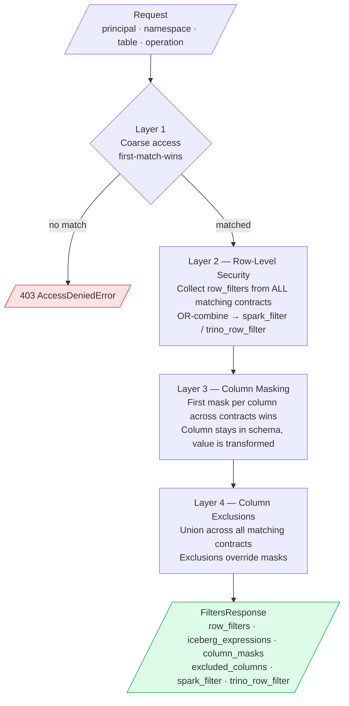

# Data Contracts — Fine-Grained Access Control

## Overview

Data contracts define the complete access policy for catalog resources across four layers:



```
Layer 1 — Coarse access:   principals × namespaces × tables × operations → allow / deny
Layer 2 — Row-Level:       row_filters     which rows a principal can see (RLS)
Layer 3 — Column masking:  column_masks    PII transformation at query time (CLS)
Layer 4 — Column hiding:   column_exclusions  columns invisible to principal (CLS)
```

All four layers live in a single YAML contract. Layers 2–4 are optional — omitting them
means no RLS/CLS restrictions beyond the coarse access grant in Layer 1.

---

## Contract schema

```yaml
version: "1.0"
contracts:
  - id: "unique-id"
    name: "Human-readable name"
    description: "What this contract enforces"

    # Layer 1 — Coarse access (required)
    principals:   ["client-id", "*"]        # OAuth client_ids; * = any
    namespaces:   ["gold", "silver_*"]       # fnmatch patterns
    tables:       ["*"]                      # fnmatch patterns
    operations:   ["read", "write", "drop", "admin"]

    # Layer 2 — Row-Level Security (optional)
    row_filters:
      - table: "orders"                      # table name or "*" for all
        filter_expression: "region = 'EMEA'" # SQL WHERE clause (no WHERE keyword)
        iceberg_expression:                  # optional: enables Iceberg scan pushdown
          type: eq                           # skips Parquet files via column statistics
          term: region
          value: EMEA

    # Layer 3 — Column masking (optional)
    column_masks:
      - table: "customers"
        column: "email"
        mask_expression: "CONCAT(LEFT(email, 2), '****@****.com')"

    # Layer 4 — Column exclusions (optional)
    column_exclusions:
      - table: "customers"
        columns: ["ssn", "credit_card_number", "date_of_birth"]

    enabled: true
```

---

## Evaluation rules

### Layer 1 — Access decision

First matching contract wins (ordered evaluation). Default deny if no match.

```
Request: analytics-client → read → gold.orders
  → contract "admin-full-access":        principal match? NO
  → contract "sync-service-write":       principal match? NO
  → contract "analytics-gold-read":      principal match? YES, namespace? YES,
                                          table? YES, operation? YES → ALLOW
```

### Layer 2 — Row filters (OR-combined)

When a principal has **multiple** contracts with row filters for the same table,
the filters are **OR-combined** — the principal sees rows matching ANY filter:

```
Contract A row_filter: region = 'EMEA'
Contract B row_filter: department = 'FINANCE'

Effective WHERE clause: (region = 'EMEA') OR (department = 'FINANCE')
```

If **no** row filters exist in any matching contract, the principal has full row access.

### Layer 3 — Column masks (first match per column wins)

Contracts are evaluated in order. The first contract that specifies a mask for a given
column wins. Put the most-restrictive contracts earlier in the YAML file.

### Layer 4 — Column exclusions (union)

If **any** matching contract excludes a column, it is excluded — regardless of other
contracts. Exclusions take precedence over masks: if a column is both masked and excluded,
the exclusion wins.

---

## Verifying the policy service

The two core endpoints — `/check` and `/filters` — are your primary tools for confirming
that contracts are loaded and evaluated correctly. **Neither endpoint touches MinIO, Nessie,
or any Iceberg data.** They read only from the in-memory contracts loaded at startup from
`contracts/default.yaml`. Use them freely to verify policy behaviour without any storage
dependency.

### Service health

```bash
curl -s http://localhost:8082/health | jq .
# Expected: {"status": "ok", "service": "policy", "contracts": 4, ...}
```

The `contracts` count must match the number of `enabled: true` entries in your YAML. A mismatch
means the service is running old code or the file failed to parse — reload with:

```bash
curl -s -X POST http://localhost:8082/reload | jq .
```

### Verify a coarse access decision (Layer 1)

```bash
# Should be allowed
curl -s -X POST http://localhost:8082/check \
  -H "Content-Type: application/json" \
  -d '{"principal":"analytics-client","resource":{"namespace":"gold","table":"orders"},"operation":"read"}' \
  | jq '{allowed, matched_contract}'
# Expected: {"allowed": true, "matched_contract": "analytics-gold-read"}

# Should be denied (analytics-client has no write access)
curl -s -X POST http://localhost:8082/check \
  -H "Content-Type: application/json" \
  -d '{"principal":"analytics-client","resource":{"namespace":"gold","table":"orders"},"operation":"write"}' \
  | jq '{allowed, reason}'
# Expected: {"allowed": false, "reason": "No contract grants ..."}
```

### Verify RLS + CLS filters (Layers 2–4)

```bash
curl -s "http://localhost:8082/filters?principal=analytics-client&namespace=gold&table=customers" \
  | jq '{row_filters, iceberg_expressions, excluded_columns}'
```

The response is built entirely from the contract YAML — it describes what filters a query engine
**must apply** when this principal reads this table. It is not a data query and does not scan any
Parquet files. An empty `row_filters` list means unrestricted row access (no RLS); an empty
`excluded_columns` list means all columns are visible (no CLS).

```bash
# Check all four default principals in one pass
for p in admin-client sync-service analytics-client data-scientist; do
  echo "=== $p on gold.orders ===";
  curl -s "http://localhost:8082/filters?principal=$p&namespace=gold&table=orders" \
    | jq '{access, row_filters: (.row_filters | length), excluded: (.excluded_columns | length)}';
done
```

---

## RLS — Row-Level Security

### `/filters` endpoint

The policy service exposes a dedicated endpoint for query engines:

```
GET /filters?principal=analytics-client&namespace=gold&table=orders
```

Response:
```json
{
  "principal": "analytics-client",
  "resource": {"namespace": "gold", "table": "orders"},
  "access": "granted",
  "row_filters": ["region = 'EMEA'"],
  "iceberg_expressions": [
    {"type": "eq", "term": "region", "value": "EMEA"}
  ],
  "column_masks": {
    "customer_email": "CONCAT(LEFT(customer_email, 2), '****@****.com')",
    "ip_address": "CONCAT(SPLIT_PART(ip_address, '.', 1), '.***.***.***')"
  },
  "excluded_columns": ["ssn", "credit_card_number", "date_of_birth", "passport_number"],
  "matched_contracts": ["analytics-gold-read"],
  "spark_filter": "(region = 'EMEA')",
  "trino_row_filter": "(region = 'EMEA')",
  "note": "1 contract(s) matched; 1 row filter(s) (OR-combined); 2 column mask(s); 4 excluded column(s)"
}
```

---

### Iceberg expressions — why and when to use them

`row_filters` are SQL strings — evaluated row-by-row after opening each Parquet file.
`iceberg_expressions` are structured predicate objects — evaluated by the Iceberg scan
planner **before** opening files, using Parquet column statistics (min/max per row group).

```
row_filters SQL:        open all files → read all rows → filter in memory
iceberg_expressions:    check column stats → skip files where predicate can't match
                        → open only relevant files → read only matching rows
```

For a table with 1 000 Parquet files where `region = 'EMEA'` matches 5%, Iceberg
expressions skip ~950 file opens entirely. On large tables this is the difference between
seconds and minutes.

**When to use each:**

| Situation | Use |
|-----------|-----|
| Spark with PyIceberg | `iceberg_expressions` via `to_pyiceberg_expressions()` |
| Spark SQL / `df.filter()` | `spark_filter` (SQL string) |
| Trino `SystemAccessControl` | `trino_row_filter` (SQL string) |
| DuckDB, pandas | `spark_filter` (SQL string) |
| CLS column masks | SQL strings only — no Iceberg expression equivalent |
| CLS column exclusions | column name lists only |

---

### Iceberg expression reference

All expression types supported in contract YAML and returned in `iceberg_expressions`:

| Type | Fields | Example |
|------|--------|---------|
| `eq` | `term`, `value` | `{type: eq, term: region, value: EMEA}` |
| `ne` | `term`, `value` | `{type: ne, term: status, value: CANCELLED}` |
| `lt` | `term`, `value` | `{type: lt, term: amount, value: 1000}` |
| `lte` | `term`, `value` | `{type: lte, term: amount, value: 1000}` |
| `gt` | `term`, `value` | `{type: gt, term: created_at, value: "2024-01-01"}` |
| `gte` | `term`, `value` | `{type: gte, term: created_at, value: "2024-01-01"}` |
| `in` | `term`, `values` | `{type: in, term: country, values: [GB, DE, FR]}` |
| `not_in` | `term`, `values` | `{type: not_in, term: status, values: [DELETED]}` |
| `is_null` | `term` | `{type: is_null, term: deleted_at}` |
| `not_null` | `term` | `{type: not_null, term: region}` |
| `and` | `left`, `right` | `{type: and, left: {...}, right: {...}}` |
| `or` | `left`, `right` | `{type: or, left: {...}, right: {...}}` |
| `not` | `child` | `{type: not, child: {...}}` |

---

### PyIceberg scan pushdown

```python
from iceberg_sync.auth import PolicyClient

policy = PolicyClient("http://localhost:8082", principal="analytics-client")
filters = policy.get_filters(namespace="gold", table="orders")

# Option A: PyIceberg expressions (file-level pruning)
from pyiceberg.catalog import load_catalog
catalog = load_catalog("nessie", **nessie_config)
table = catalog.load_table("gold.orders")

scan = table.scan()
for expr in filters.to_pyiceberg_expressions():   # converts dicts → PyIceberg objects
    scan = scan.filter(expr)

df = scan.to_arrow().to_pandas()

# Option B: SQL string fallback (no pyiceberg required)
import duckdb
conn = duckdb.connect()
conn.register("orders", df)
if filters.spark_filter:
    df = conn.execute(f"SELECT * FROM orders WHERE {filters.spark_filter}").df()
```

`to_pyiceberg_expressions()` returns an empty list if `pyiceberg` is not installed —
the SQL string fallback via `spark_filter` always works.

### Spark integration

```python
from pyspark.sql import SparkSession, functions as F
from iceberg_sync.auth import PolicyClient

policy = PolicyClient("http://localhost:8082", principal="analytics-client")
filters = policy.get_filters(namespace="gold", table="orders")

spark = SparkSession.builder.getOrCreate()
df = spark.read.format("iceberg").load("nessie.gold.orders")

# Apply RLS: restrict rows
if filters.has_rls:
    df = df.filter(filters.spark_filter)

# Apply CLS: drop excluded columns
if filters.excluded_columns:
    df = df.drop(*filters.excluded_columns)

# Apply CLS: mask PII columns
for column, mask_expr in filters.column_masks.items():
    if column in df.columns:
        df = df.withColumn(column, F.expr(mask_expr))

df.show()
```

### Trino integration

Trino supports row filtering and column masking via the `SystemAccessControl` plugin API.

```java
// Implement SystemAccessControl in your Trino plugin:

@Override
public Optional<ViewExpression> getRowFilter(
        SystemSecurityContext context,
        QualifiedObjectName tableName) {

    String principal = context.getIdentity().getUser(); // = OAuth client_id
    String filter = policyClient.getFilters(principal,
                                             tableName.getSchemaName(),
                                             tableName.getObjectName())
                                .getTrinoRowFilter();
    return filter != null
        ? Optional.of(new ViewExpression(principal, Optional.empty(), Optional.empty(), filter))
        : Optional.empty();
}

@Override
public Optional<ViewExpression> getColumnMask(
        SystemSecurityContext context,
        QualifiedObjectName tableName,
        String columnName,
        Type type) {

    String principal = context.getIdentity().getUser();
    Map<String, String> masks = policyClient.getFilters(principal, ...).getColumnMasks();
    String maskExpr = masks.get(columnName);
    return maskExpr != null
        ? Optional.of(new ViewExpression(principal, Optional.empty(), Optional.empty(), maskExpr))
        : Optional.empty();
}
```

---

## CLS — Column-Level Security

### Column masking

Masks transform the value — the column remains in the schema. Useful for:
- PII partial redaction: show first 2 chars of email, mask the rest
- Salary bucketing: replace exact salary with a range
- IP anonymization: zero out last 3 octets

**Built-in mask patterns:**

| Data type | Example mask expression |
|-----------|------------------------|
| Email | `CONCAT(LEFT(email, 2), '****@****.com')` |
| Phone | `'***-***-****'` |
| Salary | `CASE WHEN salary < 50000 THEN '<50k' WHEN salary < 100000 THEN '50-100k' ELSE '100k+' END` |
| IP address | `CONCAT(SPLIT_PART(ip_address, '.', 1), '.0.0.0')` |
| Credit card | `CONCAT('****-****-****-', RIGHT(credit_card, 4))` |
| Postcode | `LEFT(postal_code, 3) || '***'` |
| NULL out | `NULL` |

### Column exclusions

Exclusions remove the column from the schema entirely. Use for:
- Highly sensitive identifiers (SSN, passport number, biometric data)
- Columns that should never leave the secure zone
- Regulatory compliance (GDPR right to erasure, HIPAA safe harbor)

### Python usage

```python
from iceberg_sync.auth import PolicyClient

policy = PolicyClient("http://localhost:8082", principal="analytics-client")
filters = policy.get_filters(namespace="gold", table="customers")

print(f"RLS active:       {filters.has_rls}")
print(f"CLS active:       {filters.has_cls}")
print(f"Unrestricted:     {filters.is_unrestricted}")
print(f"Row filter:       {filters.spark_filter}")
print(f"Column masks:     {filters.column_masks}")
print(f"Excluded columns: {filters.excluded_columns}")
print(f"Note:             {filters.note}")
```

---

## Default access matrix (full detail)

### `admin-client` — No restrictions

| Layer | Rule |
|-------|------|
| Access | All namespaces, all tables, all operations |
| RLS | None — sees all rows |
| CLS masks | None — sees raw values |
| CLS exclusions | None — sees all columns |

### `sync-service` — No restrictions (needs full fidelity for replication)

| Layer | Rule |
|-------|------|
| Access | All namespaces, read + write |
| RLS | None |
| CLS | None |

### `analytics-client` — Gold namespace, EMEA region, PII masked/excluded

| Layer | Rule |
|-------|------|
| Access | `gold` namespace, read only |
| RLS — orders | `region = 'EMEA'` |
| RLS — customers | `country IN ('GB','DE','FR','NL','SE','NO','DK')` |
| RLS — transactions | `region = 'EMEA' AND status = 'COMPLETED'` |
| CLS mask — customers.email | `CONCAT(LEFT(email,2),'****@****.com')` |
| CLS mask — customers.phone | `'***-***-****'` |
| CLS mask — *.ip_address | CONCAT first octet + `.***.***.***` |
| CLS excluded — customers | `ssn`, `credit_card_number`, `date_of_birth`, `passport_number` |
| CLS excluded — transactions | `raw_card_data`, `bank_account_number` |

### `data-scientist` — Silver + Bronze, no RLS, PII excluded

| Layer | Rule |
|-------|------|
| Access | `silver` + `bronze` namespaces, read only |
| RLS | None — full row access for model training |
| CLS mask — *.postal_code | `LEFT(postal_code,3) || '***'` |
| CLS mask — *.ip_address | First octet + `.0.0.0` |
| CLS excluded — * | `email`, `phone`, `ssn`, `full_name`, `date_of_birth`, `passport_number`, `credit_card_number`, `bank_account_number`, `national_id` |

---

## Testing RLS and CLS

```bash
# Get analytics-client filters for gold.customers
curl -s "http://localhost:8082/filters?principal=analytics-client&namespace=gold&table=customers" | jq .

# Get data-scientist filters for silver.transactions
curl -s "http://localhost:8082/filters?principal=data-scientist&namespace=silver&table=transactions" | jq .

# admin-client: no restrictions
curl -s "http://localhost:8082/filters?principal=admin-client&namespace=gold&table=customers" \
  | jq '{access, row_filters, excluded_columns}'
# Expected: access=granted, row_filters=[], excluded_columns=[]

# sync-service: no restrictions
curl -s "http://localhost:8082/filters?principal=sync-service&namespace=gold&table=orders" \
  | jq '.is_unrestricted'   # Will be true

# Check health — shows RLS/CLS rule counts
curl -s http://localhost:8082/health | jq .
# Expected:
# {
#   "status": "ok",
#   "service": "policy",
#   "contracts": 4,
#   "rls_rules": 3,
#   "cls_masks": 6,
#   "cls_exclusions": 13
# }
```

---

## Adding RLS/CLS to a contract at runtime

```bash
ADMIN_TOKEN="admin-secret-change-me"

curl -s -X POST http://localhost:8082/contracts \
  -H "Authorization: Bearer $ADMIN_TOKEN" \
  -H "Content-Type: application/json" \
  -d '{
    "id": "reporting-gold-emea-masked",
    "name": "Reporting Gold EMEA with PII Masking",
    "principals": ["reporting-service"],
    "namespaces": ["gold"],
    "tables": ["*"],
    "operations": ["read"],
    "row_filters": [
      {"table": "orders", "filter_expression": "region = '"'"'EMEA'"'"'"}
    ],
    "column_masks": [
      {"table": "customers", "column": "email",
       "mask_expression": "CONCAT(LEFT(email,2),'"'"'****@****.com'"'"')"}
    ],
    "column_exclusions": [
      {"table": "*", "columns": ["ssn", "credit_card_number"]}
    ],
    "enabled": true
  }'
```

---

## Architecture: where enforcement happens

```
┌─────────────────────────────────────────────────────────────────────┐
│                     Enforcement Layers                              │
│                                                                     │
│  iceberg-sync CLI / Python API                                      │
│    └─ PolicyClient.enforce()  ─────────────────► Layer 1 (coarse)  │
│       (before Nessie register)                   ALLOW / DENY       │
│                                                                     │
│  Query Engine (Spark / Trino / Flink)                               │
│    └─ PolicyClient.get_filters()  ─────────────► Layers 2-4        │
│       Before table scan:                         RLS row filters    │
│         df.filter(spark_filter)                  CLS column masks   │
│         df.drop(*excluded_columns)               CLS exclusions     │
│         df.withColumn(col, mask_expr)                               │
│                                                                     │
│  Nessie (catalog)                                                   │
│    └─ JWT validation (Quarkus OIDC) ────────────► AuthN only        │
│       (proves identity; does NOT enforce rows/columns)              │
└─────────────────────────────────────────────────────────────────────┘
```

**Nessie enforces authentication only** (is this a valid JWT?). RLS and CLS are query-time
concerns enforced by the query engine, guided by the policy service. This is the standard
enterprise pattern used by Apache Ranger, OPA, and AWS Lake Formation.
