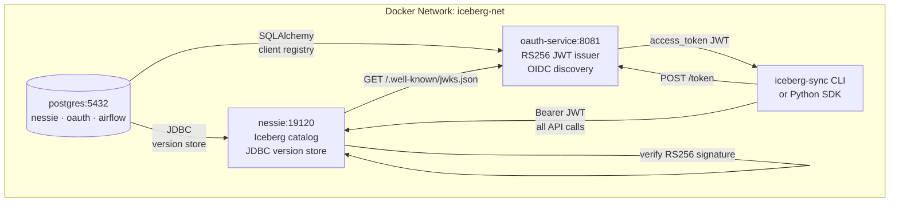
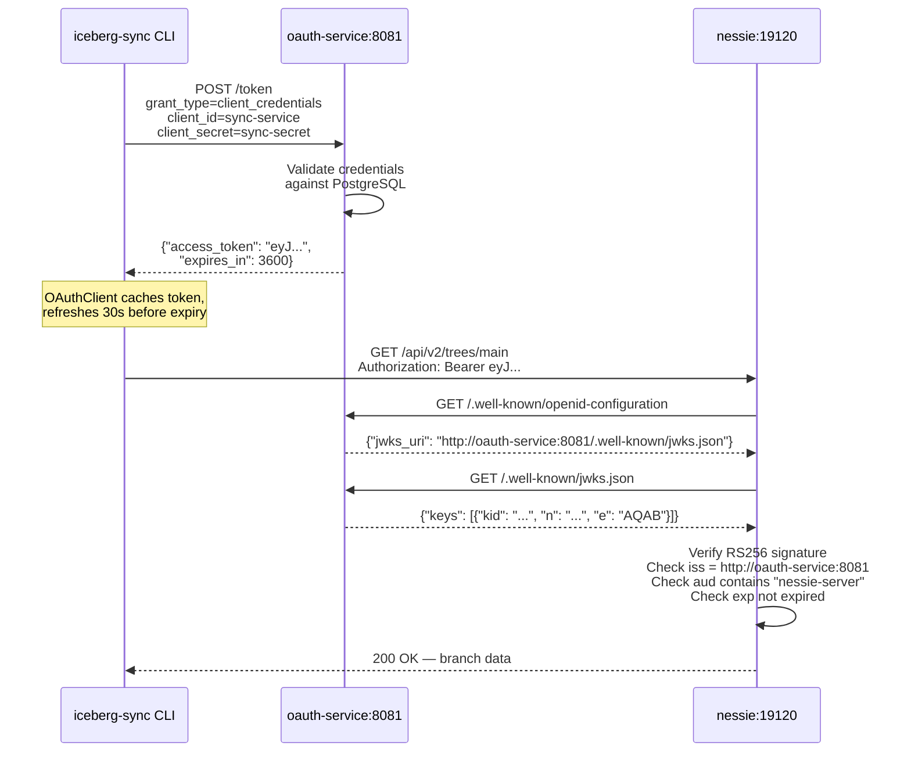
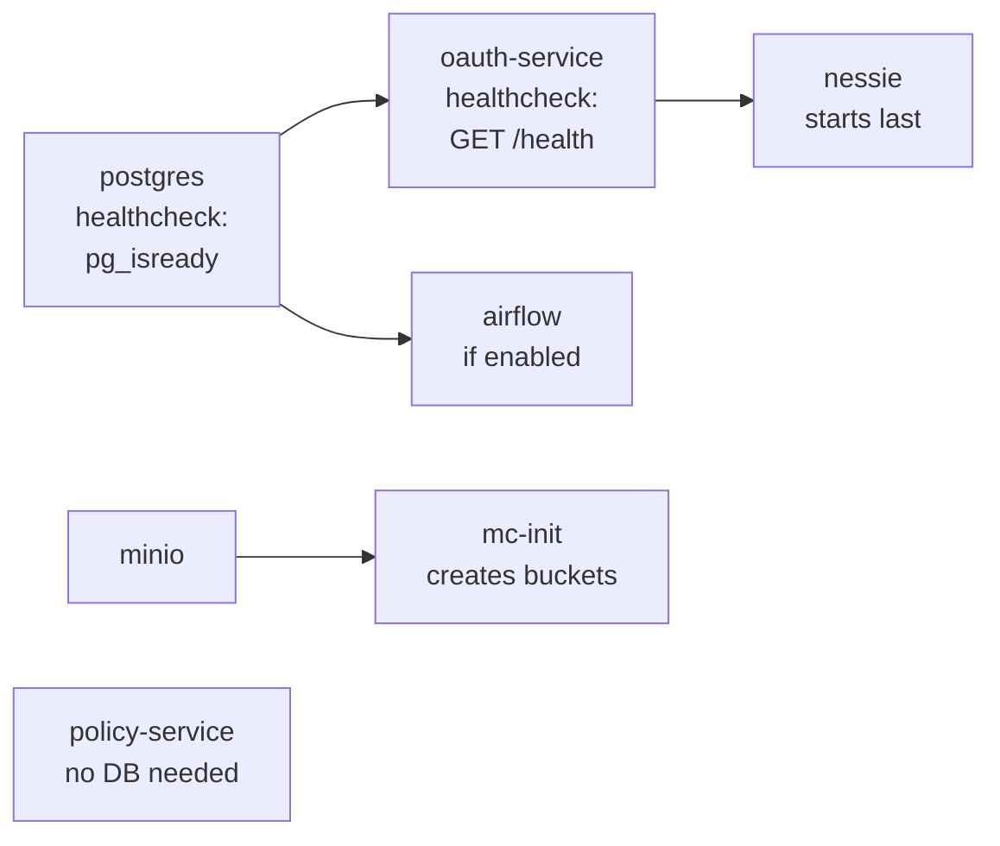

# Nessie Catalog Setup

Nessie provides transactional, Git-like branching for Iceberg tables.
This project runs Nessie with PostgreSQL as the version store and RS256 JWT authentication.

---

## Architecture



---

## PostgreSQL setup

A single PostgreSQL instance hosts all three databases, created by `docker/postgres/init-dbs.sh`
on first start:

| Database | Owner | Used by |
|----------|-------|---------|
| `nessie` | `nessie` | Nessie version store (branches, commits, tags) |
| `oauth`  | `oauth`  | OAuth client registry and RSA key store |
| `airflow`| `airflow`| Airflow metadata (DAG runs, task state) |

The init script runs automatically via Docker's `docker-entrypoint-initdb.d/` hook — no manual
database setup required.

---

## Nessie Docker configuration

Key environment variables in `docker/docker-compose.yml`:

```yaml
nessie:
  image: ghcr.io/projectnessie/nessie:0.91.3
  environment:
    # Version store: PostgreSQL (persistent across restarts)
    NESSIE_VERSION_STORE_TYPE: JDBC
    QUARKUS_DATASOURCE_JDBC_URL: jdbc:postgresql://postgres:5432/nessie
    QUARKUS_DATASOURCE_USERNAME: nessie
    QUARKUS_DATASOURCE_PASSWORD: nessie

    # JWT authentication: Quarkus OIDC
    NESSIE_SERVER_AUTHENTICATION_ENABLED: "true"
    QUARKUS_OIDC_AUTH_SERVER_URL: http://oauth-service:8081
    QUARKUS_OIDC_CLIENT_ID: nessie-server
    QUARKUS_OIDC_TOKEN_ISSUER: http://oauth-service:8081
```

> **Important:** Nessie uses the **native v2 API** (`/api/v2`). The Iceberg REST
> compatibility layer (`/iceberg/v1`) is **not used** and returns 404 on tested versions.
> Never reintroduce `/iceberg/v1` paths.

---

## JWT Authentication Flow



### Issuer URL note

The JWT `iss` claim is `http://oauth-service:8081` (Docker-internal hostname). Nessie
resolves this inside the Docker network. From your host machine you reach the OAuth service
at `http://localhost:8081` (port-mapped) — but the `iss` embedded in the token must match
what Nessie expects via its internal DNS.

### Token auto-refresh

`OAuthClient` in `src/iceberg_sync/auth/oauth_client.py` caches tokens and refreshes
them automatically 30 seconds before expiry. Long-running Airflow DAGs never need to
manually manage tokens.

---

## NessieCatalog Python client

The `NessieCatalog` class wires OAuth and Policy together transparently:

```python
from iceberg_sync.auth import OAuthClient, PolicyClient
from iceberg_sync.catalog.nessie import NessieCatalog

oauth = OAuthClient(
    server_url="http://localhost:8081",
    client_id="sync-service",
    client_secret="sync-secret",
    scope="catalog:read catalog:write",
)

policy = PolicyClient(
    service_url="http://localhost:8082",
    principal="sync-service",
)

nessie = NessieCatalog(
    uri="http://localhost:19120",
    oauth_client=oauth,      # _OAuthTokenAuth injects refreshed token on every request
    policy_client=policy,    # enforces data contracts before any write
)

# List tables in a namespace
tables = nessie.list_tables("gold")

# Register a new table (policy enforced + OAuth token auto-injected)
nessie.register_or_update("gold", "orders", "s3a://warehouse/target/gold/orders/metadata/v2.metadata.json")
```

### How `_OAuthTokenAuth` works

`NessieCatalog` uses a `requests.auth.AuthBase` subclass:

```python
class _OAuthTokenAuth(AuthBase):
    def __call__(self, r):
        r.headers["Authorization"] = f"Bearer {self._oauth.get_token()}"
        return r
```

Every HTTP request to Nessie calls `get_token()` — which returns the cached token or
fetches a fresh one if it is within 30 seconds of expiry. No manual refresh logic needed.

---

## Nessie API examples

All requests require a valid Bearer token.

```bash
# Get a token first
TOKEN=$(curl -s -X POST http://localhost:8081/token \
  -d "grant_type=client_credentials&client_id=admin-client&client_secret=admin-secret" \
  | jq -r .access_token)

# List branches
curl -s -H "Authorization: Bearer $TOKEN" \
  http://localhost:19120/api/v2/trees | jq .

# Get main branch HEAD
curl -s -H "Authorization: Bearer $TOKEN" \
  http://localhost:19120/api/v2/trees/main | jq .reference

# List tables in gold namespace
curl -s -H "Authorization: Bearer $TOKEN" \
  "http://localhost:19120/api/v2/trees/main/entries?filter=entry.namespace.startsWith('gold')" | jq .

# Get content for gold.orders
curl -s -H "Authorization: Bearer $TOKEN" \
  "http://localhost:19120/api/v2/trees/main/contents/gold.orders" | jq .
```

---

## Startup order

Nessie must start **after** both PostgreSQL and OAuth service are healthy:



Docker Compose `depends_on` with `condition: service_healthy` enforces this order.

---

## Smoke test

```bash
# Start the stack
cd docker && docker compose up -d

# Watch until all services are healthy
docker compose ps

# Get token
TOKEN=$(curl -s -X POST http://localhost:8081/token \
  -d "grant_type=client_credentials&client_id=admin-client&client_secret=admin-secret" \
  | jq -r .access_token)

# Verify Nessie accepts the token
curl -s -H "Authorization: Bearer $TOKEN" \
  http://localhost:19120/api/v2/trees/main | jq .reference.name
# Expected: "main"
```

---

## Troubleshooting

### Nessie missing from `docker compose ps`

Nessie only starts when `oauth-service` reports `healthy`. If oauth-service is `unhealthy`,
Nessie is never scheduled.

```bash
# Check which services are unhealthy
docker compose ps

# Inspect the failing service
docker compose logs oauth-service --tail=40
```

The most common cause: health check uses `curl` but `python:3.11-slim` has no `curl`.
The fix is already applied — health checks use `python -c "import urllib.request; ..."`.
If you hit this after a fresh clone, rebuild:

```bash
docker compose build --no-cache oauth-service policy-service
docker compose up -d
```

### Nessie logs show health checks but nothing else

Repeated `GET /q/health/ready 200` lines mean Nessie **is running** — Docker polls this
endpoint every 15 seconds to maintain the `healthy` status. It is not stuck.

Confirm it is serving requests:

```bash
TOKEN=$(curl -s -X POST http://localhost:8081/token \
  -d "grant_type=client_credentials&client_id=admin-client&client_secret=admin-secret" \
  | jq -r .access_token)
curl -s -H "Authorization: Bearer $TOKEN" http://localhost:19120/api/v2/trees/main | jq .
```

### Nessie returns `401` on every request

```bash
# 1. Confirm token is well-formed
echo $TOKEN | cut -d. -f2 | base64 -d 2>/dev/null | jq '{iss,aud,exp}'
# iss = "http://oauth-service:8081"
# aud contains "nessie-server"
# exp > current Unix timestamp

# 2. If token looks fine, Nessie's OIDC cache may be stale — restart it
docker compose restart nessie
```

### `docker compose down -v` wipes all data

Use `down` (no `-v`) to preserve PostgreSQL data across restarts. Use `-v` only when you
need a clean slate (e.g. after a hash-format change or broken first-time init).
