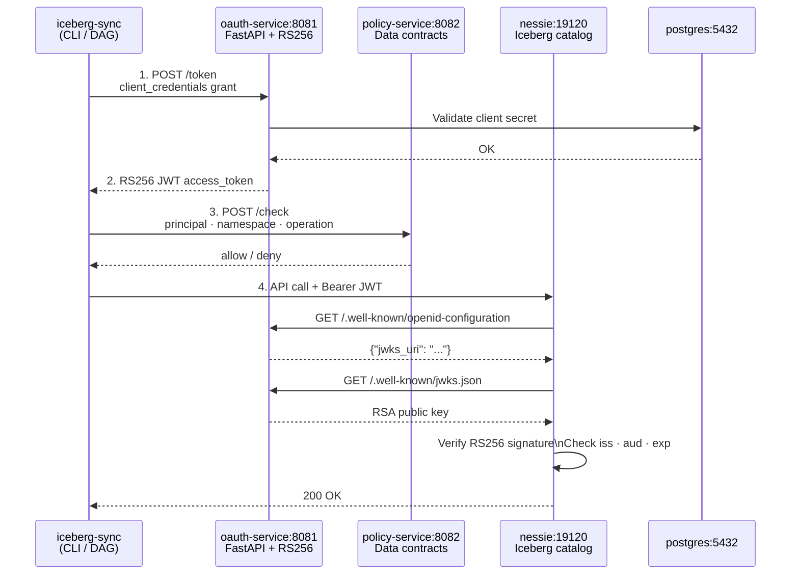

# OAuth Setup Guide

## Overview

The catalog-sync stack ships with a self-contained OAuth 2.0 authorization server. It issues
RS256 JWT access tokens that Nessie validates via OIDC discovery. The policy service then
enforces fine-grained data contract rules on top of that authentication.



---

## Starting the stack

```bash
cd docker
docker compose up -d

# Watch startup (Nessie waits for oauth-service to be healthy)
docker compose logs -f oauth-service nessie
```

Startup order enforced by health checks:
```
postgres → oauth-service → nessie
postgres → (no dependency) minio → mc-init
policy-service (independent, no DB needed)
```

---

## Getting an access token

The OAuth service is reachable at `http://localhost:8081` from your host machine.

```bash
# sync-service token (read + write)
curl -s -X POST http://localhost:8081/token \
  -d "grant_type=client_credentials" \
  -d "client_id=sync-service" \
  -d "client_secret=sync-secret" \
  -d "scope=catalog:read catalog:write" | jq .

# analytics-client token (read only)
curl -s -X POST http://localhost:8081/token \
  -d "grant_type=client_credentials" \
  -d "client_id=analytics-client" \
  -d "client_secret=analytics-secret"
```

Response:
```json
{
  "access_token": "eyJhbGciOiJSUzI1NiIsImtpZCI6ImNhdGFsb2ctc3luYy1rZXktMSJ9...",
  "token_type": "Bearer",
  "expires_in": 3600,
  "scope": "catalog:read catalog:write",
  "client_id": "sync-service"
}
```

JWT payload (decoded):
```json
{
  "iss": "http://oauth-service:8081",
  "sub": "sync-service",
  "aud": ["nessie-server"],
  "scope": "catalog:read catalog:write",
  "client_id": "sync-service",
  "exp": 1234567890,
  "jti": "uuid-..."
}
```

> **Note on issuer URL**: The `iss` claim is `http://oauth-service:8081` (the Docker-internal
> hostname). This is intentional — Nessie resolves it from inside the Docker network. From your
> host, you request tokens via `http://localhost:8081` (the mapped port), but the token's `iss`
> points to the internal service name. This is standard practice for containerized OIDC setups.

---

## Default clients

| Client ID          | Secret              | Scopes                                          |
|--------------------|---------------------|-------------------------------------------------|
| `admin-client`     | `admin-secret`      | `catalog:read write admin drop`                 |
| `sync-service`     | `sync-secret`       | `catalog:read catalog:write`                    |
| `analytics-client` | `analytics-secret`  | `catalog:read`                                  |
| `data-scientist`   | `ds-secret`         | `catalog:read`                                  |

> Change secrets before any non-local deployment via environment variables.

---

## CLI usage with OAuth

```bash
# Sync a table using OAuth for automatic token management
iceberg-sync table \
  --source-root "abfss://iceberg@account.dfs.core.windows.net/iceberg/" \
  --target-root "s3a://warehouse/azure/" \
  --table "gold/top_customers" \
  --source-secret-key "$ADLS_KEY" \
  --target-endpoint http://localhost:9000 \
  --target-access-key minioadmin \
  --target-secret-key minioadmin \
  --nessie-uri http://localhost:19120 \
  --oauth-url http://localhost:8081 \
  --oauth-client-id sync-service \
  --oauth-client-secret sync-secret \
  --policy-url http://localhost:8082

# Via environment variables (recommended for CI/CD)
export OAUTH_URL=http://localhost:8081
export OAUTH_CLIENT_ID=sync-service
export OAUTH_CLIENT_SECRET=sync-secret
export POLICY_URL=http://localhost:8082

iceberg-sync table \
  --source-root ... --target-root ... --table gold/top_customers \
  --nessie-uri http://localhost:19120
```

---

## Managing clients (admin API)

The admin API requires the admin token in the `Authorization: Bearer` header.

```bash
ADMIN_TOKEN="admin-secret-change-me"

# List all clients
curl -s http://localhost:8081/clients \
  -H "Authorization: Bearer $ADMIN_TOKEN" | jq .

# Register a new client
curl -s -X POST http://localhost:8081/clients \
  -H "Authorization: Bearer $ADMIN_TOKEN" \
  -H "Content-Type: application/json" \
  -d '{
    "client_id": "reporting-service",
    "client_secret": "report-secret-xyz",
    "name": "Reporting Service",
    "description": "Power BI / Tableau reporting layer",
    "scopes": "catalog:read"
  }'

# Deactivate a client (revoke access)
curl -s -X DELETE http://localhost:8081/clients/reporting-service \
  -H "Authorization: Bearer $ADMIN_TOKEN"
```

---

## Token introspection

Verify a token is valid and inspect its claims:

```bash
TOKEN=$(curl -s -X POST http://localhost:8081/token \
  -d "grant_type=client_credentials&client_id=sync-service&client_secret=sync-secret" \
  | jq -r .access_token)

curl -s -X POST http://localhost:8081/introspect \
  -d "token=$TOKEN" | jq .
```

Response:
```json
{
  "active": true,
  "client_id": "sync-service",
  "scope": "catalog:read catalog:write",
  "sub": "sync-service",
  "iss": "http://oauth-service:8081",
  "exp": 1234567890,
  "iat": 1234564290
}
```

---

## OIDC discovery

Nessie auto-configures from the discovery document:

```bash
curl -s http://localhost:8081/.well-known/openid-configuration | jq .
curl -s http://localhost:8081/.well-known/jwks.json | jq .
```

---

## Production considerations

For production, replace the OAuth service with a hardened identity provider:

| Provider            | Config change                                                         |
|---------------------|-----------------------------------------------------------------------|
| **Keycloak**        | `QUARKUS_OIDC_AUTH_SERVER_URL=https://keycloak/realms/catalog`        |
| **Azure AD**        | `QUARKUS_OIDC_AUTH_SERVER_URL=https://login.microsoftonline.com/{tid}/v2.0` |
| **Okta**            | `QUARKUS_OIDC_AUTH_SERVER_URL=https://your.okta.com/oauth2/default`  |
| **AWS Cognito**     | `QUARKUS_OIDC_AUTH_SERVER_URL=https://cognito-idp.{region}.amazonaws.com/{pool}` |

The Python `OAuthClient` in `src/iceberg_sync/auth/oauth_client.py` works with any
standard OAuth 2.0 client credentials endpoint — no changes needed to the sync code.
