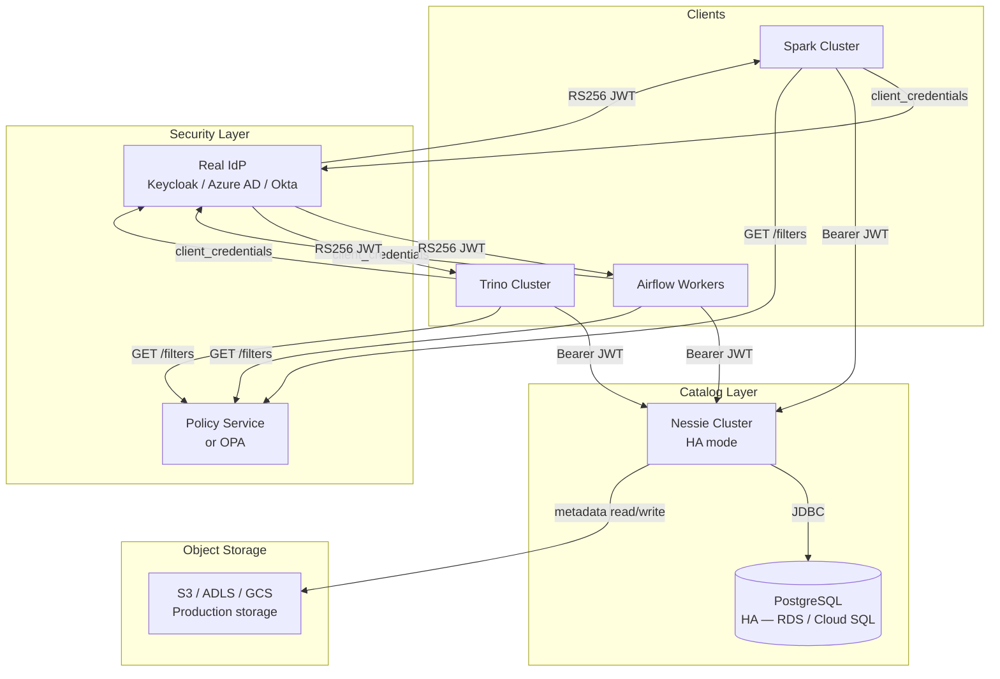

# Production Deployment

Guidance for running the catalog sync stack in a production environment.

---

## Architecture at scale



---

## Replace the built-in OAuth service with a real IdP

The built-in `oauth-service` is for local development only. In production, replace it with
your organisation's identity provider. The `OAuthClient` works with any standard
`client_credentials` endpoint.

### Nessie OIDC configuration per provider

| Provider | `QUARKUS_OIDC_AUTH_SERVER_URL` |
|----------|-------------------------------|
| Keycloak | `https://keycloak.internal/realms/catalog` |
| Azure AD | `https://login.microsoftonline.com/{tenant-id}/v2.0` |
| Okta | `https://your.okta.com/oauth2/default` |
| AWS Cognito | `https://cognito-idp.{region}.amazonaws.com/{pool-id}` |

Update `OAuthClient` in your app:

```python
oauth = OAuthClient(
    server_url="https://keycloak.internal/realms/catalog",
    client_id="sync-service",
    client_secret=os.environ["SYNC_CLIENT_SECRET"],  # from Vault / K8s secret
    scope="catalog:read catalog:write",
)
```

No other code changes needed — `NessieCatalog` and `PolicyClient` are IdP-agnostic.

---

## Secrets management

Never commit secrets to the repository. Use one of:

| Platform | Approach |
|----------|----------|
| Kubernetes | `kind: Secret` + `envFrom` in pod spec |
| HashiCorp Vault | Vault agent sidecar injecting env vars |
| AWS | Secrets Manager + ECS task role |
| Azure | Key Vault + Managed Identity |
| Airflow | Airflow Secrets Backend (Vault / AWS SM) |

Environment variables consumed by the stack:

| Service | Variable | Secret? |
|---------|----------|---------|
| oauth-service | `ADMIN_TOKEN` | Yes — change from default |
| oauth-service | `DATABASE_URL` | Yes — full PostgreSQL DSN |
| policy-service | `ADMIN_TOKEN` | Yes |
| iceberg-sync | `OAUTH_CLIENT_SECRET` | Yes |
| iceberg-sync | `POLICY_URL` | No |

---

## PostgreSQL in production

The built-in single PostgreSQL container is for development. In production:

- Use a managed service: AWS RDS, Azure Database for PostgreSQL, Cloud SQL
- Run Nessie's database on a separate instance from OAuth (different security boundary)
- Enable TLS for all JDBC connections:
  ```
  QUARKUS_DATASOURCE_JDBC_URL=jdbc:postgresql://prod-pg:5432/nessie?ssl=true&sslmode=require
  ```
- Set up automated backups and point-in-time recovery

---

## Nessie high availability

Nessie supports multiple replicas with a shared PostgreSQL version store:

```yaml
# All replicas point to the same JDBC URL
NESSIE_VERSION_STORE_TYPE: JDBC
QUARKUS_DATASOURCE_JDBC_URL: jdbc:postgresql://prod-pg.internal:5432/nessie
```

Optimistic concurrency in Nessie's commit protocol handles concurrent writes from
multiple replicas safely.

---

## Replace in-memory policy with OPA

For server-side enforcement (blocking Spark clients directly), deploy the policy service
as an HTTP proxy in front of Nessie, or integrate with [Open Policy Agent](https://www.openpolicyagent.org/).

The `/check` API contract is compatible with OPA's input/output model:

```rego
# OPA equivalent of the policy service /check endpoint
package catalog.authz

default allow := false

allow if {
    some contract in data.contracts
    contract.enabled
    principal_matches(contract)
    namespace_matches(contract)
    table_matches(contract)
    operation_matches(contract)
}

principal_matches(c) if {
    some p in c.principals
    glob.match(p, [], input.principal)
}
```

---

## TLS everywhere

In production, all service-to-service communication should use TLS:

1. Put Nessie, OAuth, and Policy behind a reverse proxy (nginx / Envoy / API Gateway)
2. Issue certificates via Let's Encrypt (cert-manager on Kubernetes) or your internal CA
3. Update `QUARKUS_OIDC_AUTH_SERVER_URL` to the HTTPS URL of the OAuth service

---

## Observability

| What to monitor | Metric / log |
|----------------|-------------|
| Token grant rate | `POST /token` request count (OAuth service) |
| Policy deny rate | `POST /check` → `allowed: false` count (Policy service) |
| Nessie commit rate | Nessie JVM metrics (`nessie_commits_total`) |
| Sync throughput | `files_copied`, `bytes_copied` from CLI/operator stdout |
| Nessie health | `GET /api/v2/config` — returns 200 when healthy |

Structured JSON logging is enabled by default on all FastAPI services. Ship logs to your
SIEM (Splunk, Datadog, OpenSearch) for policy audit trails.

---

## Checklist before going live

- [ ] `ADMIN_TOKEN` changed on both oauth-service and policy-service
- [ ] Built-in `oauth-service` replaced with production IdP (or hardened with TLS)
- [ ] PostgreSQL on managed service with backups enabled
- [ ] All client secrets stored in Vault / Kubernetes Secrets
- [ ] TLS enabled on all endpoints
- [ ] Policy contracts reviewed — default `admin-client` and `sync-service` contracts scoped down
- [ ] `analytics-client` and `data-scientist` default secrets rotated
- [ ] Nessie `main` branch protected (requires PR/review workflow if using branch policies)
- [ ] Airflow Variables using a secrets backend (not plain-text UI)
