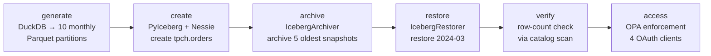
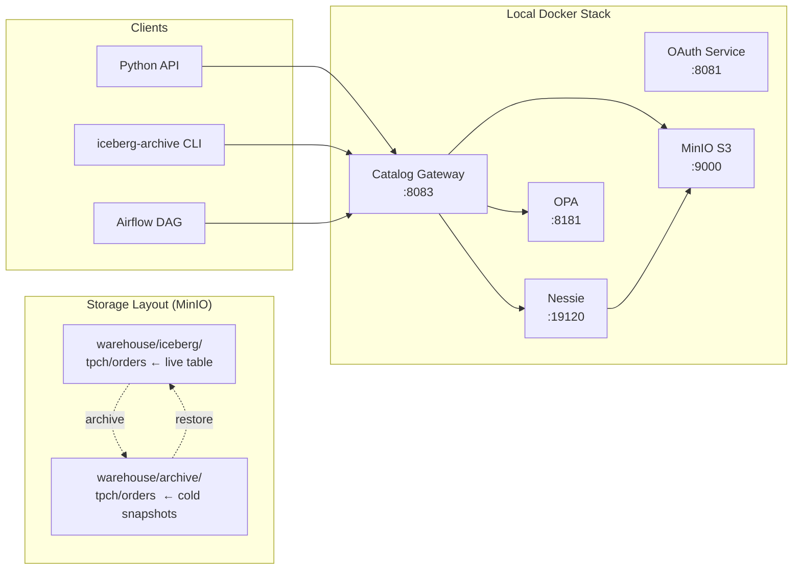
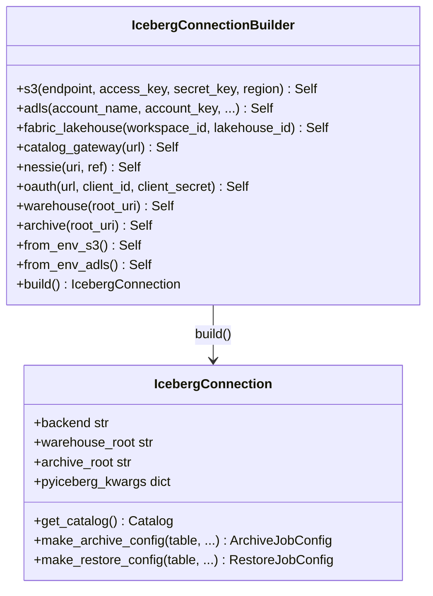
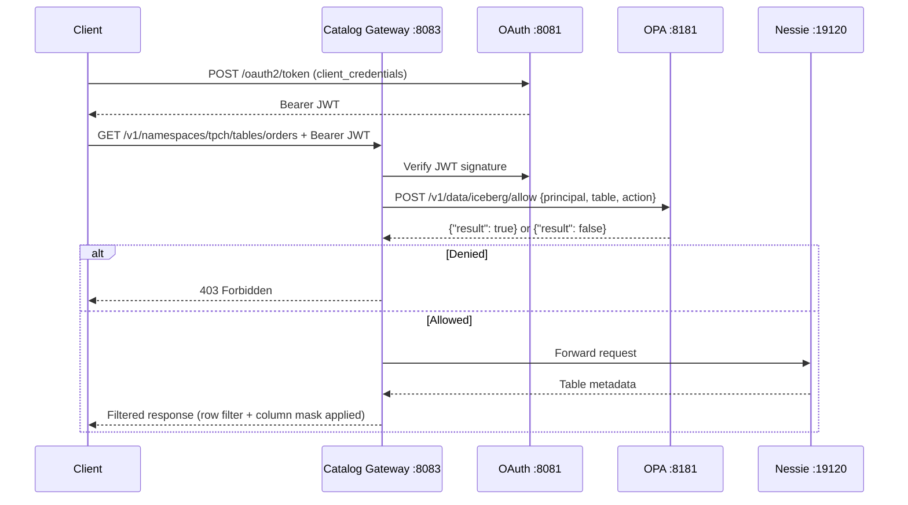
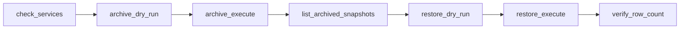
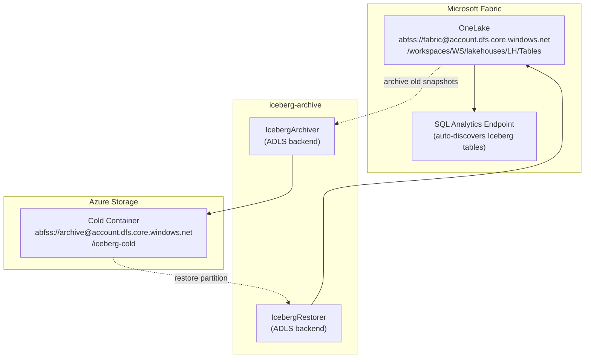

# End-to-End Test Guide — Iceberg Archive & Restore

This guide walks you through the complete archive and restore pipeline using a
TPC-H-like dataset. Every step has **Python API**, **CLI**, and **Airflow** samples.
A separate section covers **Microsoft Fabric / ADLS Gen2**.

---

## Contents

| # | Section | What it covers |
|---|---------|----------------|
| ★ | [Quick Start](#quick-start--full-workflow-in-one-command) | Run all stages in one command (start here) |
| — | [Architecture](#architecture) | Docker stack and storage layout |
| 1 | [Prerequisites](#1-prerequisites) | Docker stack, Python env |
| 2 | [Connection Builder](#2-connection-builder) | `IcebergConnectionBuilder` — unified S3 + ADLS API |
| 3 | [Generate Test Data](#3-generate-test-data) | 150 MB TPC-H Parquet files |
| 4 | [Create Iceberg Table](#4-create-iceberg-table) | 10 monthly partitions — S3 or ADLS |
| 5 | [Verify Partitions](#5-verify-partitions) | Row-count check |
| 6 | [Archive Old Partitions](#6-archive-old-partitions) | Keep last 5, archive first 5 |
| 7 | [Restore a Partition](#7-restore-a-partition) | Bring March 2024 back |
| 8 | [Access Control Demo](#8-access-control-demo) | OPA / catalog-gateway enforcement |
| 9 | [Airflow Pipeline](#9-airflow-pipeline) | Full DAG with 7 tasks |
| 10 | [ADLS Gen2 + Microsoft Fabric](#10-adls-gen2--microsoft-fabric) | OneLake as Iceberg warehouse |

---

## Quick Start — Full Workflow in One Command

[full_workflow.py](scripts/full_workflow.py) runs every stage in sequence and
prints a final summary. It uses `IcebergConnectionBuilder` internally, so the
same script works for both S3 and ADLS backends without any code changes.

```bash
# 1. Start the local Docker stack
docker compose -f docker/docker-compose.yml up -d

# 2. Install dependencies
pip install "iceberg-catalog-sync[archive]" "pyiceberg[s3,nessie]" duckdb pyarrow boto3 rich

# 3. Run the full workflow (S3/MinIO — ~150 MB dataset, all 6 stages)
python e2e/scripts/full_workflow.py

# Quick smoke-test with a smaller dataset (~15 MB)
python e2e/scripts/full_workflow.py --rows 150000

# Skip data generation if Parquet files already exist from a previous run
python e2e/scripts/full_workflow.py --skip-generate

# Run only specific stages
python e2e/scripts/full_workflow.py --stages create,archive,restore,verify

# ADLS Gen2 / Microsoft Fabric
export AZURE_STORAGE_ACCOUNT=myfabricaccount
export AZURE_STORAGE_KEY=<key>
export FABRIC_WORKSPACE_ID=<ws-guid>
export FABRIC_LAKEHOUSE_ID=<lh-guid>
export ARCHIVE_ROOT="abfss://archive@myfabricaccount.dfs.core.windows.net/iceberg-cold"
python e2e/scripts/full_workflow.py --backend adls
```

### What each stage does



| Stage | Key action | Uses |
|-------|-----------|------|
| `generate` | DuckDB produces 1.5 M rows in 10 monthly Parquet files | `duckdb`, `pyarrow` |
| `create` | Create `tpch.orders` Iceberg table, load all 10 partitions | `conn.get_catalog()` |
| `archive` | Dry-run plan then execute: archive 5 oldest months | `conn.make_archive_config()` |
| `restore` | List → plan → execute: bring `order_month=2024-03` back | `conn.make_restore_config()` |
| `verify` | Scan table, assert restored partition has rows | `conn.get_catalog()` |
| `access` | Call catalog-gateway with 4 OAuth roles, show enforcement | raw PyIceberg |

> `access` stage is S3/gateway only — skipped automatically when `--backend adls`
> (the ADLS/Fabric setup does not include the catalog-gateway service).

### Sample terminal output

```
╭───────────────────────────────────────────────────────╮
│  Iceberg Archive & Restore — Full Workflow             │
│                                                        │
│  Backend   : s3                                        │
│  Warehouse : s3a://warehouse/iceberg                   │
│  Archive   : s3a://warehouse/archive                   │
│  Stages    : generate, create, archive, restore,       │
│              verify, access                            │
╰───────────────────────────────────────────────────────╯

╭── Stage 1/6 — GENERATE ──╮
  •  Generating 1,500,000 rows spanning 2024-01 → 2024-10 …
  ✓  order_month=2024-01   149,823 rows  (14.8 MB)
  ✓  order_month=2024-02   139,751 rows  (13.8 MB)
  ...
  ✓  order_month=2024-10   155,102 rows  (15.3 MB)

╭── Stage 2/6 — CREATE ──╮
  •  Created namespace 'tpch'
  ✓  Created 'tpch.orders' at s3a://warehouse/iceberg/tpch/orders
  ✓  order_month=2024-01   149,823 rows loaded
  ...

╭── Stage 3/6 — ARCHIVE ──╮
  •  Plan: 5 snapshot(s) to archive, 5 files, 77,631,488 bytes
  •  Executing archive …
  ✓  Archived 5 snapshot(s), 5 files, 77,631,488 bytes

╭── Stage 4/6 — RESTORE ──╮
  •  Restoring order_month=2024-03 from archive …
  •  Plan: 1 file(s), 14,680,064 bytes, conflicts=False
  •  Executing restore …
  ✓  Restored 1 file(s), 14,680,064 bytes

╭── Stage 5/6 — VERIFY ──╮
  order_month  rows
  ══════════════════════════════
  2024-03      139,751  ← restored
  2024-06      148,922
  ...
  Total: 749,120 rows across 6 partitions
  ✓  Restored partition order_month=2024-03 has 139,751 rows ✓

╭── Stage 6/6 — ACCESS ──╮
  Client             Status  Rows        Note
  ════════════════════════════════════════════
  admin-client       OK      749,120     Unrestricted admin
  sync-service       OK      749,120     Read + write all namespaces
  analytics-client   OK      ~300,000    Gold read · EMEA rows · PII masked
  data-scientist     403     —           Gateway enforcement ✓ — access denied

╭── End-to-End Workflow Complete ──╮
  Backend     : s3
  Warehouse   : s3a://warehouse/iceberg
  Archive     : s3a://warehouse/archive
  Elapsed     : 47.3s
  Generated   : 10 months  148.9 MB  (12.4s)
  Table       : tpch.orders  10 partitions  1,500,000 rows
  Archived    : 5 snapshot(s)  5 files  77,631,488 bytes
  Restored    : order_month=2024-03  1 files  14,680,064 bytes
  Verify      : 749,120 total rows  6 partitions  restored=139,751
  Access ctrl : 3 allowed  1 blocked by OPA
```

---

## Architecture



---

## 1. Prerequisites

### 1.1 Start the Docker stack

```bash
# From the repo root — starts Nessie, MinIO, OAuth, OPA, Catalog Gateway
docker compose -f docker/docker-compose.yml up -d

# Wait for all services to be healthy (≈30 s)
docker compose -f docker/docker-compose.yml ps
```

Service endpoints:

| Service | URL | Credentials |
|---------|-----|-------------|
| Catalog Gateway (Iceberg REST) | http://localhost:8083 | OAuth token |
| OAuth service | http://localhost:8081 | see below |
| MinIO console | http://localhost:9001 | minioadmin / minioadmin |
| OPA admin | http://localhost:8181 | — |

Default OAuth clients:

| Client ID | Secret | Role |
|-----------|--------|------|
| `admin-client` | `admin-secret` | Unrestricted |
| `sync-service` | `sync-secret` | Read + write all namespaces |
| `analytics-client` | `analytics-secret` | Gold read, EMEA rows, PII masked |
| `data-scientist` | `ds-secret` | Silver/bronze read, PII excluded |

### 1.2 Install Python dependencies

```bash
# Core archive module + PyIceberg for table creation
pip install "iceberg-catalog-sync[archive]"
pip install "pyiceberg[s3,nessie]"
pip install duckdb pyarrow boto3
```

---

## 2. Connection Builder

`connection.py` is the single place that knows about credentials.
All scripts import it; none of them contain raw credential dicts.



### S3 / MinIO

```python
from connection import IcebergConnectionBuilder

conn = (
    IcebergConnectionBuilder()
    .s3(endpoint="http://localhost:9000",
        access_key="minioadmin",
        secret_key="minioadmin")
    .catalog_gateway("http://localhost:8083")
    .oauth("http://localhost:8081/oauth2/token",
           client_id="admin-client",
           client_secret="admin-secret")
    .nessie("http://localhost:19120")
    .warehouse("s3a://warehouse/iceberg")
    .archive("s3a://warehouse/archive")
    .build()
)
```

### ADLS Gen2 / Microsoft Fabric

```python
conn = (
    IcebergConnectionBuilder()
    .adls(account_name="myfabricaccount", account_key="<key>")
    .fabric_lakehouse(workspace_id="<ws-guid>", lakehouse_id="<lh-guid>")
    # or service principal: .adls(..., tenant_id=..., client_id=..., client_secret=...)
    # or managed identity:  .adls(..., use_default_credential=True)
    .oauth("<oauth-url>", client_id="sync-service", client_secret="<secret>")
    .nessie("http://nessie:19120")
    .archive("abfss://archive@myfabricaccount.dfs.core.windows.net/iceberg-cold")
    .build()
)
```

### From environment variables (no code changes between dev/prod)

```python
# S3 — reads MINIO_ENDPOINT, MINIO_ACCESS_KEY, GATEWAY_URL, OAUTH_URL, …
conn = IcebergConnectionBuilder.from_env_s3().build()

# ADLS — reads AZURE_STORAGE_ACCOUNT, FABRIC_WORKSPACE_ID, ARCHIVE_ROOT, …
conn = IcebergConnectionBuilder.from_env_adls().build()
```

### Common API — same code regardless of backend

```python
# PyIceberg catalog
catalog = conn.get_catalog()
table   = catalog.load_table("tpch.orders")

# Archive config → IcebergArchiver
archive_cfg = conn.make_archive_config(
    "tpch/orders", older_than="150d", min_snapshots_to_keep=5
)

# Restore config → IcebergRestorer
restore_cfg = conn.make_restore_config(
    "tpch/orders",
    partitions=[{"order_month": "2024-03"}],
    as_of="2024-04-01",
)
```

---

## 3. Generate Test Data

Generates a synthetic TPC-H orders dataset partitioned by `order_month` (YYYY-MM).

```
e2e/data/orders/
  order_month=2024-01/part-0.parquet   (~15 MB, ~150k rows)
  order_month=2024-02/part-0.parquet
  ...
  order_month=2024-10/part-0.parquet
Total: ~150 MB, ~1.5M rows
```

### Python

```bash
python e2e/scripts/01_generate_tpch.py
# For 3 GB: --rows 30000000
python e2e/scripts/01_generate_tpch.py --rows 30000000
```

### CLI equivalent

The generation script has no CLI equivalent — it is pure Python using DuckDB.

---

## 4. Create Iceberg Table

Creates `tpch/orders` in the Nessie catalog and loads all 10 monthly partitions.
The unified `iceberg_table.py` script works identically for both backends —
only `--backend` changes.

### Python (unified script)

```bash
# S3 / MinIO (local Docker stack)
python e2e/scripts/iceberg_table.py --backend s3 create-table

# ADLS Gen2 / Fabric  (env vars set per section 10)
python e2e/scripts/iceberg_table.py --backend adls create-table
```

<details>
<summary>Inline builder usage — same API for both backends</summary>

```python
import sys; sys.path.insert(0, "e2e/scripts")
from connection import IcebergConnectionBuilder

# S3
conn = (
    IcebergConnectionBuilder()
    .s3(endpoint="http://localhost:9000", access_key="minioadmin", secret_key="minioadmin")
    .catalog_gateway("http://localhost:8083")
    .oauth("http://localhost:8081/oauth2/token",
           client_id="admin-client", client_secret="admin-secret")
    .warehouse("s3a://warehouse/iceberg")
    .archive("s3a://warehouse/archive")
    .build()
)

catalog = conn.get_catalog()
table   = catalog.create_table("tpch.orders", schema=SCHEMA, partition_spec=SPEC,
                                location=f"{conn.warehouse_root}/tpch/orders")
table.append(arrow_table)   # repeat for each monthly Parquet file
```

</details>

### Optional: Sync to AWS S3

After the local table is set up you can sync it to AWS S3 using the core sync CLI:

```bash
iceberg-sync table \
  --source-root s3a://warehouse/iceberg \
  --source-endpoint http://localhost:9000 \
  --source-access-key minioadmin \
  --source-secret-key minioadmin \
  --target-root s3://my-aws-bucket/iceberg \
  --target-region us-east-1 \
  --table tpch/orders
```

---

## 5. Verify Partitions

Confirms all 10 monthly partitions are present and shows row counts.

### Python

```bash
python e2e/scripts/03_verify_partitions.py
```

Expected output:

```
Row counts by partition (order_month):
-----------------------------------
  order_month=2024-01     149 823 rows
  order_month=2024-02     139 751 rows
  ...
  order_month=2024-10     155 102 rows
-----------------------------------
  TOTAL                 1 500 000 rows
Partitions found: 10
```

### CLI

```bash
iceberg-archive snapshots \
  --archive-root s3a://warehouse/archive \
  --table tpch/orders \
  --archive-endpoint http://localhost:9000 \
  --archive-access-key minioadmin \
  --archive-secret-key minioadmin
# (no snapshots yet — archive step hasn't run)
```

---

## 6. Archive Old Partitions

Archives the 5 oldest monthly snapshots (2024-01 → 2024-05) to
`s3a://warehouse/archive/` and removes them from the primary table.

```
Retention policy:
  older_than=150d  +  min_snapshots_to_keep=5
  → keeps the 5 most recent snapshots on primary
  → archives the 5 oldest snapshots to cold storage
```

### Python (unified script)

```bash
# S3 — dry-run
python e2e/scripts/iceberg_table.py --backend s3 archive

# S3 — execute
python e2e/scripts/iceberg_table.py --backend s3 archive --execute

# ADLS — execute
python e2e/scripts/iceberg_table.py --backend adls archive --execute
```

<details>
<summary>Using the builder directly</summary>

```python
import sys; sys.path.insert(0, "e2e/scripts")
from connection import IcebergConnectionBuilder
from iceberg_sync.archive.archiver import IcebergArchiver

conn = (
    IcebergConnectionBuilder()
    .s3(endpoint="http://localhost:9000", access_key="minioadmin", secret_key="minioadmin")
    .nessie("http://localhost:19120")
    .oauth("http://localhost:8081/oauth2/token",
           client_id="sync-service", client_secret="sync-secret")
    .warehouse("s3a://warehouse/iceberg")
    .archive("s3a://warehouse/archive")
    .build()
)

cfg      = conn.make_archive_config("tpch/orders", older_than="150d", min_snapshots_to_keep=5)
archiver = IcebergArchiver.from_config(cfg)
result   = archiver.archive_table("tpch/orders", dry_run=False)
print(f"Archived: {result.snapshots_archived} snapshots, {result.files_copied} files")
```

</details>

### CLI

```bash
# Dry-run
iceberg-archive archive \
  --source-root s3a://warehouse/iceberg \
  --archive-root s3a://warehouse/archive \
  --table tpch/orders \
  --older-than 150d \
  --min-snapshots-to-keep 5 \
  --source-endpoint http://localhost:9000 \
  --source-access-key minioadmin \
  --source-secret-key minioadmin \
  --archive-endpoint http://localhost:9000 \
  --archive-access-key minioadmin \
  --archive-secret-key minioadmin \
  --nessie-uri http://localhost:19120 \
  --oauth-url http://localhost:8081/oauth2/token \
  --oauth-client-id sync-service \
  --oauth-client-secret sync-secret

# Execute (add --no-dry-run)
iceberg-archive archive --config e2e/configs/archive.yaml --no-dry-run
```

### CLI via config file

```bash
# Dry-run using config file
iceberg-archive archive --config e2e/configs/archive.yaml

# Execute
iceberg-archive archive --config e2e/configs/archive.yaml --no-dry-run
```

### Airflow

```python
from airflow.operators.python import PythonOperator

def archive_task(**ctx):
    from iceberg_sync.archive.archiver import IcebergArchiver
    from iceberg_sync.archive.config import ArchiveJobConfig, S3Config, CatalogConfig
    cfg = ArchiveJobConfig(
        source_root="s3a://warehouse/iceberg",
        table="tpch/orders",
        archive_root="s3a://warehouse/archive",
        older_than="150d", min_snapshots_to_keep=5, delete_after_archive=True,
        source_s3=S3Config(endpoint="http://minio:9000", access_key="minioadmin", secret_key="minioadmin"),
        archive_s3=S3Config(endpoint="http://minio:9000", access_key="minioadmin", secret_key="minioadmin"),
        catalog=CatalogConfig(nessie_uri="http://nessie:19120",
                              oauth_url="http://oauth-service:8081/oauth2/token",
                              oauth_client_id="sync-service", oauth_client_secret="sync-secret"),
    )
    archiver = IcebergArchiver.from_config(cfg)
    result = archiver.archive_table("tpch/orders", dry_run=False)
    if not result.success:
        raise RuntimeError(result.errors)
    ctx["ti"].xcom_push("archive_result", {"files": result.files_copied})

archive = PythonOperator(task_id="archive_execute", python_callable=archive_task)
```

See the full DAG at [e2e/airflow_dags/archive_pipeline_dag.py](airflow_dags/archive_pipeline_dag.py).

---

## 7. Restore a Partition

Brings the March 2024 partition (`order_month=2024-03`) back from cold storage
into the live table.

```
Restore workflow:
  Step 1  list_snapshots()  — see what is in the archive index
  Step 2  plan()            — dry-run shows files, size, conflicts
  Step 3  execute(plan)     — copy files + rewrite metadata
```

### Python (unified script)

```bash
# S3 — plan only
python e2e/scripts/iceberg_table.py --backend s3 restore --month 2024-03

# S3 — execute
python e2e/scripts/iceberg_table.py --backend s3 restore --month 2024-03 --confirm

# ADLS — execute
python e2e/scripts/iceberg_table.py --backend adls restore --month 2024-03 --confirm
```

<details>
<summary>Using the builder directly</summary>

```python
import sys; sys.path.insert(0, "e2e/scripts")
from connection import IcebergConnectionBuilder
from iceberg_sync.archive.restorer import IcebergRestorer

conn = (
    IcebergConnectionBuilder()
    .s3(endpoint="http://localhost:9000", access_key="minioadmin", secret_key="minioadmin")
    .nessie("http://localhost:19120")
    .oauth("http://localhost:8081/oauth2/token",
           client_id="sync-service", client_secret="sync-secret")
    .warehouse("s3a://warehouse/iceberg")
    .archive("s3a://warehouse/archive")
    .build()
)

cfg      = conn.make_restore_config("tpch/orders",
                                    partitions=[{"order_month": "2024-03"}],
                                    as_of="2024-04-01",
                                    mode="replace",
                                    conflict_strategy="skip")
restorer = IcebergRestorer.from_config(cfg)
restorer.list_snapshots()       # Step 1
plan   = restorer.plan()        # Step 2 — always review before executing
result = restorer.execute(plan) # Step 3 — data copied before metadata rewritten
print(f"Restored {result.files_copied} files → {result.new_metadata_uri}")
```

</details>

### CLI

```bash
# Step 1: Browse available snapshots
iceberg-archive snapshots \
  --archive-root s3a://warehouse/archive \
  --table tpch/orders \
  --archive-endpoint http://localhost:9000 \
  --archive-access-key minioadmin \
  --archive-secret-key minioadmin

# Step 2: Plan (no --confirm = safe dry-run)
iceberg-archive restore \
  --archive-root s3a://warehouse/archive \
  --target-root s3a://warehouse/iceberg \
  --table tpch/orders \
  --partition "order_month=2024-03" \
  --as-of 2024-04-01 \
  --mode replace \
  --conflict-strategy skip \
  --archive-endpoint http://localhost:9000 \
  --archive-access-key minioadmin \
  --archive-secret-key minioadmin \
  --target-endpoint http://localhost:9000 \
  --target-access-key minioadmin \
  --target-secret-key minioadmin

# Step 3: Execute (add --confirm)
iceberg-archive restore --config e2e/configs/restore.yaml --confirm
```

### Airflow

```python
from airflow.operators.python import PythonOperator

def restore_task(**ctx):
    from iceberg_sync.archive.restorer import IcebergRestorer
    from iceberg_sync.archive.config import RestoreJobConfig, S3Config, CatalogConfig
    s3 = S3Config(endpoint="http://minio:9000", access_key="minioadmin", secret_key="minioadmin")
    cfg = RestoreJobConfig(
        archive_root="s3a://warehouse/archive", table="tpch/orders",
        target_root="s3a://warehouse/iceberg", as_of="2024-04-01",
        partitions=[{"order_month": "2024-03"}],
        mode="replace", conflict_strategy="skip",
        archive_s3=s3, target_s3=s3,
        catalog=CatalogConfig(nessie_uri="http://nessie:19120", ...),
    )
    restorer = IcebergRestorer.from_config(cfg)
    plan = restorer.plan()
    result = restorer.execute(plan)
    if not result.success:
        raise RuntimeError(result.errors)
    ctx["ti"].xcom_push("restore_result", {"files": result.files_copied})

restore = PythonOperator(task_id="restore_execute", python_callable=restore_task)
```

---

## 8. Access Control Demo

Demonstrates OPA / catalog-gateway enforcement with four role types.



### Python

```bash
python e2e/scripts/06_access_control.py
```

Expected results:

| Client | Status | Rows | Notes |
|--------|--------|------|-------|
| `admin-client` | OK | 1,500,000 | All rows, all columns |
| `sync-service` | OK | 1,500,000 | All rows, all columns |
| `analytics-client` | OK | ~300,000 | EMEA rows only; `clerk` column masked |
| `data-scientist` | 403 | — | `tpch` (gold) namespace blocked |

### CLI: Get a token and make a raw REST call

```bash
# Get OAuth token for analytics-client
TOKEN=$(curl -s -X POST http://localhost:8081/oauth2/token \
  -d "grant_type=client_credentials&client_id=analytics-client&client_secret=analytics-secret&scope=catalog:read" \
  | python -c "import sys,json; print(json.load(sys.stdin)['access_token'])")

# Call the catalog-gateway Iceberg REST endpoint
curl -H "Authorization: Bearer $TOKEN" \
     http://localhost:8083/v1/namespaces/tpch/tables/orders | python -m json.tool

# This should return the table metadata with row filter applied.
# Accessing a table the client is not allowed on returns 403:
curl -i -H "Authorization: Bearer $TOKEN" \
     http://localhost:8083/v1/namespaces/bronze/tables/transactions
# HTTP/1.1 403 Forbidden
```

### Airflow

For production pipelines, always use a service account with only the
permissions it needs:

```python
from airflow.models import Variable

# Inject OAuth credentials from Airflow Variables (set in the UI)
OAUTH_CLIENT_ID     = Variable.get("ICEBERG_CLIENT_ID",     default_var="sync-service")
OAUTH_CLIENT_SECRET = Variable.get("ICEBERG_CLIENT_SECRET", default_var="")
```

---

## 9. Airflow Pipeline

The full end-to-end DAG is at
[e2e/airflow_dags/archive_pipeline_dag.py](airflow_dags/archive_pipeline_dag.py).

### Start Airflow

```bash
# Extends the main stack — adds airflow-webserver and airflow-scheduler
docker compose \
  -f docker/docker-compose.yml \
  -f docker/docker-compose.airflow.yml \
  up -d

# Open http://localhost:8080  (admin / admin)
# Enable the DAG: iceberg_archive_restore_e2e
```

### DAG structure



### Trigger manually

```bash
# Via CLI inside the scheduler container
docker exec -it airflow-scheduler \
  airflow dags trigger iceberg_archive_restore_e2e

# Via REST API
curl -X POST http://localhost:8080/api/v1/dags/iceberg_archive_restore_e2e/dagRuns \
  -H "Content-Type: application/json" \
  -u admin:admin \
  -d '{"conf": {}}'
```

### XCom outputs

Each task pushes a summary to XCom for downstream tasks and monitoring:

| Task | XCom key | Contents |
|------|----------|----------|
| `archive_dry_run` | `archive_plan` | `{snapshots_to_archive, files_to_copy, bytes_to_copy}` |
| `archive_execute` | `archive_result` | `{snapshots_archived, files_copied, bytes_copied}` |
| `list_archived_snapshots` | `snapshot_ids` | `[snap_id, ...]` |
| `restore_execute` | `restore_result` | `{files_restored, bytes_restored, new_metadata_uri}` |
| `verify_row_count` | — | Asserts row count > 0 |

---

## 10. ADLS Gen2 + Microsoft Fabric

Microsoft Fabric stores Iceberg table data and metadata in **OneLake**, which
exposes an ADLS Gen2 endpoint. The archive module reads and writes directly to
this endpoint — no Fabric SDK required.

### Architecture



### 10.1 Environment setup

```bash
export AZURE_STORAGE_ACCOUNT="myfabricaccount"
export AZURE_STORAGE_KEY="<storage account key>"

# Get these from the Fabric portal → Workspace settings → Workspace ID / Lakehouse ID
export FABRIC_WORKSPACE_ID="xxxxxxxx-xxxx-xxxx-xxxx-xxxxxxxxxxxx"
export FABRIC_LAKEHOUSE_ID="yyyyyyyy-yyyy-yyyy-yyyy-yyyyyyyyyyyy"

# Optional: Nessie catalog pointer (leave empty to use version-hint.text)
export NESSIE_URI=""
```

> **Tip — Use service principal instead of account key:**
> ```bash
> export AZURE_TENANT_ID="<tenant>"
> export AZURE_CLIENT_ID="<app-id>"
> export AZURE_CLIENT_SECRET="<secret>"
> # Then use `use_default_credential: true` in the ADLS config
> ```

### 10.2 Install ADLS dependencies

```bash
pip install "iceberg-catalog-sync[archive]"
pip install "azure-storage-blob>=12.19" "azure-identity>=1.15"
pip install "pyiceberg[adls]"
```

### 10.3 Create Iceberg table in Fabric Lakehouse

```bash
python e2e/scripts/01_generate_tpch.py               # generate data if not done
python e2e/scripts/iceberg_table.py --backend adls create-table
```

<details>
<summary>Builder pattern — PyIceberg with ADLS backend</summary>

```python
import sys; sys.path.insert(0, "e2e/scripts")
from connection import IcebergConnectionBuilder

conn = (
    IcebergConnectionBuilder()
    .adls(account_name="myfabricaccount", account_key="<key>")
    # Service principal alternative:
    # .adls(account_name="prod",
    #       tenant_id="<tenant>", client_id="<app>", client_secret="<secret>")
    # Managed identity:
    # .adls(account_name="prod", use_default_credential=True)
    .fabric_lakehouse(workspace_id="<ws-guid>", lakehouse_id="<lh-guid>")
    .archive("abfss://archive@myfabricaccount.dfs.core.windows.net/iceberg-cold")
    .build()
)

catalog = conn.get_catalog()           # SqlCatalog backed by local SQLite
table   = catalog.create_table(
    "tpch.orders",
    schema=SCHEMA, partition_spec=SPEC,
    location=f"{conn.warehouse_root}/tpch/orders",
)
table.append(arrow_table)
```

Fabric auto-discovers the table in the **SQL Analytics Endpoint** once
`v00001.metadata.json` and `version-hint.text` are written to OneLake.

</details>

### 10.4 Archive old partitions to cold ADLS

```bash
# Dry-run
python e2e/scripts/iceberg_table.py --backend adls archive

# Execute
python e2e/scripts/iceberg_table.py --backend adls archive --execute
```

#### CLI

```bash
iceberg-archive archive \
  --source-root "abfss://fabric@${AZURE_STORAGE_ACCOUNT}.dfs.core.windows.net/workspaces/${FABRIC_WORKSPACE_ID}/lakehouses/${FABRIC_LAKEHOUSE_ID}/Tables" \
  --archive-root "abfss://archive@${AZURE_STORAGE_ACCOUNT}.dfs.core.windows.net/iceberg-cold" \
  --table tpch/orders \
  --older-than 150d \
  --min-snapshots-to-keep 5 \
  --no-dry-run
```

#### Config file

```bash
iceberg-archive archive --config e2e/configs/archive_adls.yaml --no-dry-run
```

See [e2e/configs/archive_adls.yaml](configs/archive_adls.yaml) for the full config.

### 10.5 Restore a partition from cold storage to Fabric

```bash
# Plan only
python e2e/scripts/iceberg_table.py --backend adls restore --month 2024-03

# Execute
python e2e/scripts/iceberg_table.py --backend adls restore --month 2024-03 --confirm
```

#### CLI

```bash
iceberg-archive restore \
  --archive-root "abfss://archive@${AZURE_STORAGE_ACCOUNT}.dfs.core.windows.net/iceberg-cold" \
  --target-root  "abfss://fabric@${AZURE_STORAGE_ACCOUNT}.dfs.core.windows.net/workspaces/${FABRIC_WORKSPACE_ID}/lakehouses/${FABRIC_LAKEHOUSE_ID}/Tables" \
  --table tpch/orders \
  --partition "order_month=2024-03" \
  --as-of 2024-04-01 \
  --mode replace \
  --conflict-strategy skip \
  --confirm
```

See [e2e/configs/restore_adls.yaml](configs/restore_adls.yaml).

### 10.6 Verify in Fabric SQL Analytics Endpoint

```bash
python e2e/scripts/iceberg_table.py --backend adls verify --month 2024-03
```

Or run directly in the **Fabric portal** (SQL Analytics Endpoint tab):

```sql
-- Confirm the restored partition is visible
SELECT  order_month,
        COUNT(*)             AS row_count,
        SUM(total_price)     AS revenue
FROM    tpch.orders
WHERE   order_month = '2024-03'
GROUP BY order_month;
```

#### Airflow (ADLS)

```python
from airflow.operators.python import PythonOperator

def archive_adls_task(**ctx):
    from iceberg_sync.archive.archiver import IcebergArchiver
    from iceberg_sync.archive.config import (
        ArchiveJobConfig, ADLSConfig, CatalogConfig, TransferConfig,
    )
    import os

    adls = ADLSConfig(
        account_name=os.environ["AZURE_STORAGE_ACCOUNT"],
        account_key=os.environ["AZURE_STORAGE_KEY"],
    )
    cfg = ArchiveJobConfig(
        source_root=(
            f"abfss://fabric@{os.environ['AZURE_STORAGE_ACCOUNT']}.dfs.core.windows.net"
            f"/workspaces/{os.environ['FABRIC_WORKSPACE_ID']}"
            f"/lakehouses/{os.environ['FABRIC_LAKEHOUSE_ID']}/Tables"
        ),
        table="tpch/orders",
        archive_root=(
            f"abfss://archive@{os.environ['AZURE_STORAGE_ACCOUNT']}.dfs.core.windows.net"
            "/iceberg-cold"
        ),
        older_than="150d",
        min_snapshots_to_keep=5,
        delete_after_archive=True,
        source_adls=adls,
        archive_adls=adls,
        transfer=TransferConfig(parallelism=8),
    )
    archiver = IcebergArchiver.from_config(cfg)
    result = archiver.archive_table("tpch/orders", dry_run=False)
    if not result.success:
        raise RuntimeError(result.errors)
    ctx["ti"].xcom_push("adls_archive_result", {"files": result.files_copied})

archive_adls = PythonOperator(task_id="archive_adls", python_callable=archive_adls_task)
```

### 10.7 Fabric-specific notes

| Topic | Detail |
|-------|--------|
| **OneLake path format** | `abfss://<container>@<account>.dfs.core.windows.net/<workspace>/lakehouses/<lakehouse>/Tables` |
| **Table discovery** | Fabric auto-discovers Iceberg tables when `v*.metadata.json` + `version-hint.text` exist under `Tables/` |
| **Authentication** | Account key works for dev; use managed identity or service principal in production |
| **Fabric SQL Endpoint latency** | Metadata refresh can take ~1–2 minutes after writing `version-hint.text` |
| **Delta vs Iceberg in Fabric** | Fabric natively understands both; ensure your Lakehouse is set to Iceberg format (not Delta) |
| **Cross-tenant ADLS** | Use `--source-secret-key` / `ADLSConfig(account_key=...)` — `az login` may be blocked by cross-tenant policy |

---

## File Reference

```
e2e/
├── README.md                           ← this guide
├── configs/
│   ├── archive.yaml                    ← archive job config (MinIO / local S3)
│   ├── restore.yaml                    ← restore job config (MinIO / local S3)
│   ├── archive_adls.yaml               ← archive job config (ADLS Gen2 / Fabric)
│   └── restore_adls.yaml               ← restore job config (ADLS Gen2 / Fabric)
├── scripts/
│   ├── connection.py                   ← IcebergConnectionBuilder (shared by all scripts)
│   ├── full_workflow.py                ← ★ complete end-to-end demo (start here)
│   ├── iceberg_table.py                ← unified create/archive/restore/verify (S3 + ADLS)
│   ├── 01_generate_tpch.py             ← generate TPC-H Parquet files (standalone)
│   ├── 03_verify_partitions.py         ← row-count check by partition (standalone)
│   ├── 04_archive.py                   ← archive old partitions (standalone)
│   ├── 05_restore.py                   ← restore one partition (standalone)
│   └── 06_access_control.py            ← OPA / gateway role demo (standalone)
└── airflow_dags/
    └── archive_pipeline_dag.py         ← full 7-task Airflow pipeline
```

> **Deprecated scripts** — `02_create_iceberg_table.py` and `07_adls_fabric.py` are
> superseded by `iceberg_table.py` + `connection.py` and kept only for git history.
> Do not use them in new work.

> **Start with `full_workflow.py`** — it chains all stages and prints a rich
> summary. Use `iceberg_table.py` when you need to run a single stage in isolation
> or pass custom credentials. Use the individual numbered scripts for standalone
> operations without the connection builder.

---

## Troubleshooting

| Symptom | Fix |
|---------|-----|
| `FileNotFoundError: No metadata.json found in archive` | Run archive with `--no-dry-run` first; dry-run never copies metadata |
| `No archived snapshot found` | Check `list_snapshots` — snapshot may not be old enough for the retention policy |
| MinIO `ConnectionRefusedError` | Run `docker compose up -d` and wait for `mc-init` to finish |
| `403 Forbidden` on Nessie | Gateway blocks direct Nessie access — use `http://localhost:8083` not `:19120` |
| ADLS `ResourceNotFound` | Check `FABRIC_WORKSPACE_ID` and `FABRIC_LAKEHOUSE_ID` are correct GUIDs |
| Fabric SQL Endpoint shows old data | Wait 1–2 minutes for OneLake metadata refresh |
| `already_archived` snapshots not skipped | Archive index (`.archive-manifest.json`) not written — ensure previous run used `--no-dry-run` |
